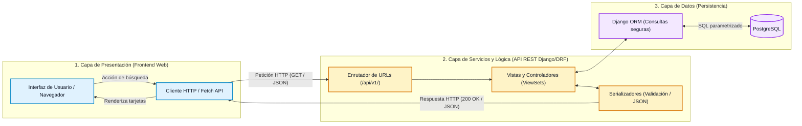
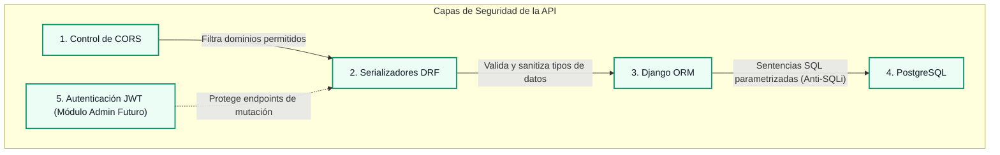

# Especificación de la API REST — RuralConecta-Proyecto

## 1. Identificación y Propósito de la API

### 1.1. Identificación del Documento

| Campo | Detalle |
|---|---|
| **Proyecto** | RuralConecta-ProyectoWeb |
| **Documento** | Especificación Técnica y Contrato de la API REST |
| **Fase del Proyecto** | Etapa 0 — Análisis, Planificación y Definición Técnica |
| **Nivel de Implementación** | Diseño Conceptual y Especificación de Contrato (Sin código ejecutable) |
| **Protocolo de Comunicación** | HTTP/1.1 y HTTPS con intercambio de datos en formato JSON |
| **Público Objetivo** | Desarrolladores Frontend, Desarrolladores Backend, Evaluadores Técnicos |

---

### 1.2. Propósito General en RuralConecta

La **API REST de RuralConecta** constituye la capa intermedia desacoplada de servicios dentro de la arquitectura del proyecto. Su función primordial es centralizar, estructurar y exponer de manera estandarizada y segura la información sobre los servicios esenciales y trámites comunitarios que se prestan en las diferentes subregiones y municipios rurales del departamento de Antioquia.

La API actúa como el punto de convergencia que resuelve la dispersión de información municipal, permitiendo:

1. **Abstraer la complejidad del almacenamiento**: Oculta la estructura interna de las tablas y consultas de la base de datos relacional (**PostgreSQL**), exponiendo únicamente recursos limpios y normalizados.
2. **Habilitar el consumo asíncrono y ligero**: Provee datos en formato **JSON** con cargas útiles (*payloads*) optimizadas para conexiones móviles intermitentes o de baja velocidad en zonas rurales.
3. **Garantizar la interoperabilidad**: Permite que cualquier cliente autorizado (inicialmente el frontend web basado en JSP/HTML5/CSS3/JavaScript Vanilla y potencialmente futuras aplicaciones móviles o quioscos comunitarios) consuma la misma fuente de verdad sin duplicar lógica de negocio.

---

### 1.3. Rol en la Comunicación Frontend — Backend — Base de Datos

Dentro del flujo de datos de la plataforma, la API REST opera como un mediador transaccional y de consulta:



- **Petición desde el Frontend**: El cliente web emite una solicitud asíncrona mediante el protocolo HTTP (ej. `GET /api/v1/servicios/?municipio=1&categoria=3`).
- **Procesamiento en el Backend**: El backend recibe la solicitud, valida los parámetros de búsqueda mediante serializadores, aplica las reglas de negocio y consulta la base de datos a través del ORM de Django.
- **Respuesta hacia el Frontend**: El backend transforma los registros relacionales de PostgreSQL en estructuras JSON legibles y las retorna junto a un código de estado HTTP adecuado (`200 OK`, `400 Bad Request`, `404 Not Found`).

---

## 2. Arquitectura de la API

### 2.1. Fundamentos del Estilo REST

La API de RuralConecta se diseña siguiendo los principios de la arquitectura **REST** (*Representational State Transfer*):

1. **Arquitectura Cliente-Servidor Desacoplada**: La interfaz de usuario (frontend) y la gestión de datos/lógica (backend) evolucionan de forma independiente.
2. **Sin Estado (*Statelessness*)**: Cada petición HTTP contiene toda la información necesaria para ser interpretada y respondida por el servidor, sin depender de sesiones almacenadas en memoria.
3. **Interfaz Uniforme**: Los recursos se identifican mediante URIs estandarizadas y se manipulan mediante métodos HTTP convencionales (`GET`, `POST`, `PUT/PATCH`, `DELETE`).
4. **Representación Basada en JSON**: Todos los intercambios de información utilizan la codificación estándar `application/json` con juego de caracteres `UTF-8`.

---

### 2.2. Concepto de Recursos y Endpoints

- **Recurso**: Cualquier entidad o concepto relevante del dominio de RuralConecta que pueda ser nombrado, consultado o manipulado (ej. un `municipio`, una `categoría`, un `servicio`).
- **Endpoint**: La dirección URI específica a través de la cual un cliente accede a la representación de un recurso o colección de recursos (ej. `/api/v1/municipios/` representa la colección completa de municipios).

---

## 3. Recursos Principales del Dominio

De acuerdo con el modelo de dominio y la especificación técnica aprobada para el MVP, se definen los siguientes recursos principales:

```text
+-----------------------------------------------------------------------------+
|                               RECURSOS DE LA API                            |
+-----------------------------------------------------------------------------+
|  1. MUNICIPIOS   ──> Entidades territoriales de Antioquia                   |
|  2. CATEGORÍAS   ──> Áreas temáticas (Salud, Educación, Transporte, etc.)   |
|  3. SERVICIOS    ──> Fichas técnicas de trámites y servicios comunitarios   |
|  4. TRÁMITES     ──> Modelados de forma unificada en el recurso Servicios   |
+-----------------------------------------------------------------------------+
```

### 3.1. Recurso: Municipios (`/municipios`)
Representa las divisiones político-administrativas del departamento de Antioquia donde se ubican y prestan los servicios.
- **Atributos**: `id` (entero), `nombre` (cadena única), `subregion` (cadena).

### 3.2. Recurso: Categorías (`/categorias`)
Representa los ejes temáticos en los que se agrupan las ofertas de trámites y servicios para facilitar la navegación ciudadana.
- **Atributos**: `id` (entero), `nombre` (cadena única), `descripcion` (texto), `icono` (cadena identificadora visual).
- **Categorías del MVP**: *Salud*, *Educación*, *Transporte*, *Servicios públicos*, *Apoyos sociales*.

### 3.3. Recurso: Servicios (`/servicios`)
Constituye el recurso nuclear de RuralConecta. Agrupa la información detallada de sedes de atención, programas sociales y dependencias comunitarias.
- **Atributos**: `id` (entero), `municipio` (objeto o clave foránea), `categoria` (objeto o clave foránea), `nombre` (cadena), `descripcion` (texto), `direccion` (cadena), `horarios` (cadena), `requisitos` (texto), `contacto` (cadena).

### 3.4. Consideración de Diseño sobre Trámites
En el modelo conceptual y relacional del MVP de RuralConecta, los **trámites** y los **servicios** se gestionan de manera unificada bajo el recurso **`Servicio`**. Esta decisión técnica obedece a:
- Ambos comparten la misma estructura informativa requerida por la comunidad rural: *entidad prestadora, municipio, categoría, ubicación, requisitos documentales, horarios de atención y canales de contacto*.
- Evita redundancia de tablas y sobreingeniería en el MVP.
- Si en fases futuras se requiere una diferenciación estricta (ej. radicación de trámites transaccionales o formularios específicos), se evaluará la incorporación de un recurso separado `/tramites/` como una **ampliación propuesta**.

---

## 4. Versionamiento de la API

Para garantizar la estabilidad del contrato de comunicación, permitir la evolución de los endpoints sin alterar el funcionamiento de clientes existentes y facilitar el mantenimiento continuo, se establece una estrategia de **versionamiento explícito en la URI**:

```text
Estructura base:
https://[dominio-del-servicio]/api/{version}/{recurso}/

Ejemplo para el MVP:
https://ruralconecta.ejemplo.gov.co/api/v1/servicios/
```

### Justificación de la Estrategia:
1. **Claridad y Simplicidad**: Permite a los desarrolladores identificar de forma inmediata la versión del contrato de datos.
2. **Compatibilidad hacia atrás**: Si en una etapa posterior se modifica el esquema de respuestas o se introducen cambios disruptivos (*breaking changes*), podrá publicarse `/api/v2/` manteniendo operativa la versión `/api/v1/`.
3. **Alineación con Django REST Framework**: Facilita la configuración del enrutamiento modular en el archivo `config/urls.py` del backend.

---

## 5. Métodos HTTP y Semántica Operativa

La API REST utiliza los métodos estándar del protocolo HTTP conforme a la semántica descrita a continuación:

| Método HTTP | Propósito Semántico | Idempotente | Seguro | Estado en el MVP de RuralConecta |
|---|---|---|---|---|
| **`GET`** | Consulta y recuperación de recursos o colecciones. | Sí | Sí | **Definido y Habilitado para el público general.** |
| **`POST`** | Creación de un nuevo recurso en el servidor. | No | No | *Propuesto para módulos de administración futuros.* |
| **`PUT`** | Reemplazo o actualización completa de un recurso existente. | Sí | No | *Propuesto para módulos de administración futuros.* |
| **`PATCH`** | Actualización parcial de campos específicos de un recurso. | No | No | *Propuesto para módulos de administración futuros.* |
| **`DELETE`** | Eliminación de un recurso específico. | Sí | No | *Propuesto para módulos de administración futuros.* |

> [!IMPORTANT]
> **Alcance Operativo del MVP**:
> Para la primera versión del Producto Mínimo Viable (MVP), el acceso público de la ciudadanía estará limitado exclusivamente al método **`GET`** (modo solo lectura). Los métodos de mutación (`POST`, `PUT`, `PATCH`, `DELETE`) quedan reservados para la fase de desarrollo del módulo administrativo y requerirán autenticación previa.

---

## 6. Catálogo de Endpoints Previstos

### 6.1. Endpoints Base (Definidos para el MVP)

A continuación se resumen los endpoints de consulta definidos para soportar los requisitos funcionales del MVP (`RF-01` a `RF-06`):

```text
GET /api/v1/municipios/
GET /api/v1/municipios/{id}/

GET /api/v1/categorias/
GET /api/v1/categorias/{id}/

GET /api/v1/servicios/
GET /api/v1/servicios/{id}/
```

| Método | Endpoint | Parámetros de Consulta | Propósito / Requisito Asociado |
|---|---|---|---|
| `GET` | `/api/v1/municipios/` | Ninguno | Retorna la lista completa de municipios registrados (`RF-01`). |
| `GET` | `/api/v1/municipios/{id}/` | `id` en path | Retorna la información detallada de un municipio particular. |
| `GET` | `/api/v1/categorias/` | Ninguno | Retorna el catálogo de categorías temáticas (`RF-02`). |
| `GET` | `/api/v1/categorias/{id}/` | `id` en path | Retorna la información de una categoría específica. |
| `GET` | `/api/v1/servicios/` | `?municipio={id}&categoria={id}` | Retorna el listado de servicios con soporte de filtros (`RF-03`, `RF-04`, `RF-05`). |
| `GET` | `/api/v1/servicios/{id}/` | `id` en path | Retorna la ficha técnica completa de un servicio (`RF-06`). |

---

### 6.2. Endpoints Complementarios / Propuestos (Fases Futuras)

Los siguientes endpoints se identifican como propuestas de diseño para futuras fases del proyecto (administración, reportería y búsqueda extendida) y **no forman parte del alcance de entrega inicial del MVP**:

> [!NOTE]
> Los siguientes endpoints tienen carácter **propuesto** y no deben asumirse como implementados en la Etapa 0 ni en el MVP base.

| Método | Endpoint Propuesto | Tipo de Acceso | Justificación / Fase Prevista |
|---|---|---|---|
| `GET` | `/api/v1/municipios/{id}/servicios/` | Público | Consulta anidada directa de servicios por municipio (*Fase 4/5 - Optimización*). |
| `GET` | `/api/v1/categorias/{id}/servicios/` | Público | Consulta anidada directa de servicios por categoría (*Fase 4/5 - Optimización*). |
| `POST` | `/api/v1/servicios/` | Administrativo (JWT) | Creación de nuevos servicios desde el Backoffice (*Ampliación Futura*). |
| `PUT` / `PATCH` | `/api/v1/servicios/{id}/` | Administrativo (JWT) | Edición de horarios, contactos y requisitos (*Ampliación Futura*). |
| `DELETE` | `/api/v1/servicios/{id}/` | Administrativo (JWT) | Eliminación lógica o física de servicios (*Ampliación Futura*). |
| `POST` | `/api/v1/auth/login/` | Público / Admin | Emisión de tokens de autenticación JWT (*Ampliación Futura*). |

---

## 7. Parámetros y Filtros de Consulta

El endpoint principal del catálogo de servicios (`/api/v1/servicios/`) admite parámetros de consulta en la URL (*Query Parameters*) para permitir una navegación adaptada al flujo de tres pasos del usuario:

$$\text{Selección de Municipio} \longrightarrow \text{Selección de Categoría} \longrightarrow \text{Listado de Servicios}$$

### 7.1. Filtrado por Municipio

Permite obtener únicamente los servicios ubicados en una jurisdicción municipal determinada.

- **Parámetro**: `municipio`
- **Tipo**: Entero (`integer`) correspondiente al `id` del municipio.
- **Ejemplo de Petición**:
  ```http
  GET /api/v1/servicios/?municipio=1 HTTP/1.1
  Host: ruralconecta.ejemplo.gov.co
  Accept: application/json
  ```

---

### 7.2. Filtrado por Categoría

Permite obtener únicamente los servicios clasificados dentro de un área temática específica.

- **Parámetro**: `categoria`
- **Tipo**: Entero (`integer`) correspondiente al `id` de la categoría.
- **Ejemplo de Petición**:
  ```http
  GET /api/v1/servicios/?categoria=3 HTTP/1.1
  Host: ruralconecta.ejemplo.gov.co
  Accept: application/json
  ```

---

### 7.3. Filtrado Combinado (Municipio y Categoría)

Permite obtener la intersección exacta de servicios para un municipio y una categoría simultáneamente.

- **Parámetros**: `municipio` y `categoria`
- **Ejemplo de Petición**:
  ```http
  GET /api/v1/servicios/?municipio=1&categoria=3 HTTP/1.1
  Host: ruralconecta.ejemplo.gov.co
  Accept: application/json
  ```

---

### 7.4. Parámetros Propuestos para Búsqueda Abierta (*Fase de Ampliación*)

Para etapas posteriores a la entrega del MVP básico, se propone la inclusión de los siguientes parámetros opcionales:

- `q`: Búsqueda textual por coincidencia en nombre o descripción del servicio (ej. `?q=vacunacion`).
- `subregion`: Filtrado de servicios por subregión de Antioquia (ej. `?subregion=Suroeste`).

---

## 8. Formato y Ejemplos de Respuestas JSON

A continuación se presentan las estructuras de datos JSON previstas para los endpoints de la API. Los ejemplos utilizan información ficticia inspirada en el contexto real de las subregiones de Antioquia:

### 8.1. Listado de Municipios: `GET /api/v1/municipios/`

- **Código HTTP de Éxito**: `200 OK`
- **Estructura**: Arreglo de objetos con datos básicos de identificación territorial.

```json
[
  {
    "id": 1,
    "nombre": "Jericó",
    "subregion": "Suroeste"
  },
  {
    "id": 2,
    "nombre": "Santa Fe de Antioquia",
    "subregion": "Occidente"
  },
  {
    "id": 3,
    "nombre": "El Carmen de Viboral",
    "subregion": "Oriente"
  }
]
```

---

### 8.2. Detalle de un Municipio: `GET /api/v1/municipios/1/`

- **Código HTTP de Éxito**: `200 OK`
- **Estructura**: Objeto individual con la información del municipio consultado.

```json
{
  "id": 1,
  "nombre": "Jericó",
  "subregion": "Suroeste"
}
```

---

### 8.3. Listado de Categorías: `GET /api/v1/categorias/`

- **Código HTTP de Éxito**: `200 OK`
- **Estructura**: Arreglo de objetos que definen las 5 categorías esenciales del MVP.

```json
[
  {
    "id": 1,
    "nombre": "Salud",
    "descripcion": "Puestos de salud, jornadas de vacunación, brigadas médicas y dispensarios.",
    "icono": "heart-pulse"
  },
  {
    "id": 2,
    "nombre": "Educación",
    "descripcion": "Sedes educativas rurales, programas de alfabetización y bibliotecas.",
    "icono": "graduation-cap"
  },
  {
    "id": 3,
    "nombre": "Transporte",
    "descripcion": "Rutas de transporte veredal, frecuencias de chivas y cooperativas locales.",
    "icono": "bus"
  },
  {
    "id": 4,
    "nombre": "Servicios públicos",
    "descripcion": "Puntos de atención de acueducto, energía, gas y reporte de fallas.",
    "icono": "droplet"
  },
  {
    "id": 5,
    "nombre": "Apoyos sociales",
    "descripcion": "Subsidios, programas de adulto mayor y asistencia técnica agrícola.",
    "icono": "users"
  }
]
```

---

### 8.4. Detalle de una Categoría: `GET /api/v1/categorias/3/`

- **Código HTTP de Éxito**: `200 OK`
- **Estructura**: Objeto individual con los datos descriptivos de la categoría.

```json
{
  "id": 3,
  "nombre": "Transporte",
  "descripcion": "Rutas de transporte veredal, frecuencias de chivas y cooperativas locales.",
  "icono": "bus"
}
```

---

### 8.5. Listado Filtrado de Servicios: `GET /api/v1/servicios/?municipio=1&categoria=1`

- **Código HTTP de Éxito**: `200 OK`
- **Estructura**: Arreglo de servicios que coinciden con los criterios de búsqueda aplicados. Incluye objetos anidados simplificados para `municipio` y `categoria` con el fin de optimizar el renderizado directo en la tarjeta del frontend sin requerir peticiones HTTP adicionales.

```json
[
  {
    "id": 1,
    "nombre": "Puesto de Salud Veredal El Salado",
    "descripcion": "Atención médica general, control de crecimiento y desarrollo, y jornadas periódicas de vacunación.",
    "direccion": "Vereda El Salado, sector La Escuela",
    "horarios": "Lunes a Jueves: 8:00 AM - 2:00 PM",
    "requisitos": "Documento de identidad original y carné de afiliación al sistema de salud.",
    "contacto": "Tel: 310 000 0001 / salud.jerico@ejemplo.gov.co",
    "municipio": {
      "id": 1,
      "nombre": "Jericó",
      "subregion": "Suroeste"
    },
    "categoria": {
      "id": 1,
      "nombre": "Salud",
      "icono": "heart-pulse"
    }
  }
]
```

---

### 8.6. Ficha Detallada de un Servicio: `GET /api/v1/servicios/2/`

- **Código HTTP de Éxito**: `200 OK`
- **Estructura**: Objeto completo con toda la información requerida para la vista de detalle del servicio (`RF-06`).

```json
{
  "id": 2,
  "nombre": "Cooperativa de Chivas Veredales Jericó",
  "descripcion": "Servicio de transporte público mixto de pasajeros y carga agrícola conectando las veredas con la cabecera municipal.",
  "direccion": "Plaza Principal, bahía oriental de transporte",
  "horarios": "Salidas diarias: 6:00 AM, 12:00 PM y 4:30 PM",
  "requisitos": "Pago del valor del pasaje en efectivo al momento de abordar la unidad.",
  "contacto": "Tel: 320 000 0002 / cooperativa.transporte@ejemplo.com",
  "municipio": {
    "id": 1,
    "nombre": "Jericó",
    "subregion": "Suroeste"
  },
  "categoria": {
    "id": 3,
    "nombre": "Transporte",
    "icono": "bus"
  }
}
```

---

## 9. Códigos de Respuesta HTTP

La API REST utiliza códigos de estado estandarizados según el estándar RFC 7231 para comunicar el resultado de cada solicitud:

| Código | Denominación | Significado en RuralConecta | Endpoints Aplicables |
|---|---|---|---|
| **`200 OK`** | Solicitud Exitosa | La consulta se procesó satisfactoriamente y el cuerpo de respuesta contiene el recurso o lista solicitada. | Todos los endpoints `GET`. |
| **`201 Created`** | Recurso Creado | Un nuevo servicio, municipio o categoría fue creado exitosamente en la base de datos. | Endpoints administrativos `POST` *(Fase futura)*. |
| **`400 Bad Request`** | Petición Incorrecta | Los parámetros enviados en la consulta son inválidos (ej. un valor alfanumérico donde se requiere un ID entero) o la estructura enviada no cumple con las validaciones. | `GET /api/v1/servicios/` con parámetros malformados, `POST`/`PUT` administrativos. |
| **`404 Not Found`** | Recurso No Encontrado | El identificador numérico solicitado no existe en la base de datos o la ruta URI especificada es incorrecta. | `GET /api/v1/municipios/{id}/`, `GET /api/v1/servicios/{id}/`, `GET /api/v1/categorias/{id}/`. |
| **`500 Internal Server Error`** | Error Interno del Servidor | Ocurrió una excepción no controlada en el backend o una falla de conectividad temporal con la base de datos PostgreSQL. | Todos los endpoints (situación anómala). |

---

## 10. Manejo Estandarizado de Errores

Para que el frontend pueda interpretar y presentar mensajes comprensibles al usuario ante fallos o solicitudes incorrectas, la API retornará una **estructura JSON uniforme de error**:

### 10.1. Esquema JSON de Error

```json
{
  "error": {
    "codigo": 404,
    "tipo": "NotFoundException",
    "mensaje": "El recurso solicitado no fue encontrado.",
    "detalles": "No existe ningún servicio registrado con el identificador ID 999."
  }
}
```

### 10.2. Ejemplos de Escenarios de Error

#### Escenario A: Recurso no encontrado (`404 Not Found`)
*Petición*: `GET /api/v1/servicios/999/`

```json
{
  "error": {
    "codigo": 404,
    "tipo": "NotFound",
    "mensaje": "Servicio no encontrado.",
    "detalles": "No se encontró ningún registro para el recurso /api/v1/servicios/999/."
  }
}
```

#### Escenario B: Parámetro de filtro inválido (`400 Bad Request`)
*Petición*: `GET /api/v1/servicios/?municipio=abc`

```json
{
  "error": {
    "codigo": 400,
    "tipo": "ValidationError",
    "mensaje": "Parámetro de consulta inválido.",
    "detalles": {
      "municipio": "El valor ingresado 'abc' no es un identificador entero válido."
    }
  }
}
```

#### Escenario C: Fallo inesperado en el servidor (`500 Internal Server Error`)
*Petición*: Cualquier endpoint ante caída de base de datos.

```json
{
  "error": {
    "codigo": 500,
    "tipo": "InternalServerError",
    "mensaje": "Se produjo un error interno en el servidor.",
    "detalles": "Por favor intente nuevamente más tarde."
  }
}
```

---

## 11. Lineamientos de Seguridad y Buenas Prácticas

En concordancia con los requisitos no funcionales (`RNF-04`) y la especificación técnica de la arquitectura, se establecen a nivel de diseño las siguientes directrices de seguridad para la API:



### 11.1. Validación Estricta de Datos
- Todos los parámetros de consulta y cuerpos de petición serán procesados obligatoriamente por los **Serializadores de Django REST Framework** (`serializers.py`).
- Se validarán tipos de datos, rangos numéricos y longitudes máximas para evitar desbordamientos o datos inconsistentes.

### 11.2. Protección contra Inyección SQL (SQL Injection)
- El acceso a PostgreSQL se realizará de forma exclusiva a través del **ORM de Django**.
- El ORM utiliza consultas preparadas y parametrizadas de manera predeterminada, aislando los valores de entrada de la sintaxis del motor SQL.
- Queda expresamente prohibido el uso de consultas SQL concatenadas en bruto (`raw SQL`).

### 11.3. Mitigación de Cross-Site Scripting (XSS)
- Todas las salidas JSON contendrán tipos de contenido explícitos (`Content-Type: application/json; charset=utf-8`).
- En el cliente web, los valores devueltos por la API se insertarán en el DOM mediante propiedades seguras (`textContent` o vinculación declarativa de datos), evitando el uso de `innerHTML` sobre datos no confiables.

### 11.4. Configuración Restrictiva de CORS (*Cross-Origin Resource Sharing*)
- Mediante el middleware `django-cors-headers`, se limitarán los orígenes autorizados para realizar peticiones HTTP hacia la API.
- En producción, únicamente el dominio asignado al frontend web de RuralConecta tendrá permiso de acceso cruzado, bloqueando peticiones no autorizadas desde dominios de terceros.

### 11.5. Estrategia de Autenticación mediante JWT (*Funcionalidad Administrativa Futura*)
- Para el MVP, las consultas `GET` de catálogo serán completamente públicas y de libre acceso comunitario.
- Si en fases posteriores se incorporan funcionalidades administrativas (creación, edición o eliminación de servicios), se adoptará autenticación mediante **JSON Web Tokens (JWT)** con tokens de acceso de corta duración y tokens de refresco (*refresh tokens*).

---

## 12. Estado de Implementación y Trazabilidad

A continuación se resume la matriz de estado de los componentes definidos en este documento, conforme a las directrices de la **Etapa 0**:

| Componente / Característica | Estado en Etapa 0 | Fase de Implementación Prevista |
|---|---|---|
| **Diseño y Contrato de la API REST** | ✅ **Definido y Documentado** | Etapa 0 (Análisis y Planificación) |
| **Esquema de URIs y Versionado (`/api/v1/`)** | ✅ **Definido y Documentado** | Etapa 0 (Análisis y Planificación) |
| **Formato de Respuestas JSON** | ✅ **Definido y Documentado** | Etapa 0 (Análisis y Planificación) |
| **Estructura de Manejo de Errores** | ✅ **Definido y Documentado** | Etapa 0 (Análisis y Planificación) |
| **Endpoints `GET` de Municipios, Categorías y Servicios** | ⏳ **Pendiente de Implementación** | Fase 2 (Desarrollo Backend con Django/DRF) |
| **Filtros de Búsqueda Combinados en Servicios** | ⏳ **Pendiente de Implementación** | Fase 2 (Desarrollo Backend con Django/DRF) |
| **Endpoints Administrativos (`POST`, `PUT`, `DELETE`)** | 💡 **Propuesto (Fuera del MVP inicial)** | Fases posteriores de ampliación |
| **Autenticación con JWT para Administradores** | 💡 **Propuesto (Fuera del MVP inicial)** | Fases posteriores de ampliación |

> [!NOTE]
> Este documento representa la **especificación técnica formal de diseño de la API REST durante la Etapa 0**. No contiene código backend ni endpoints en ejecución; su propósito es servir como contrato y guía estricta para el equipo de desarrollo durante las Fases 2 (Backend) y 3 (Frontend).
