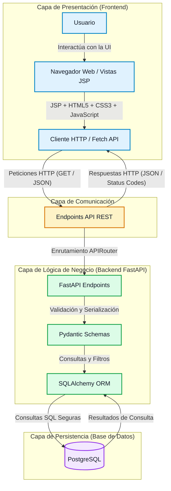
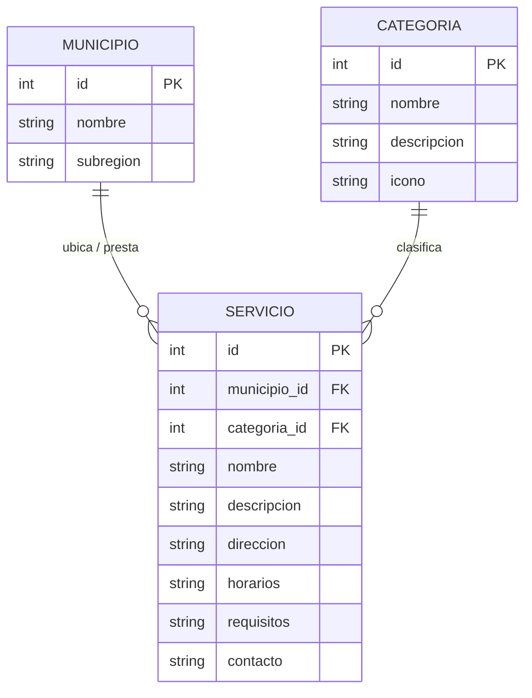
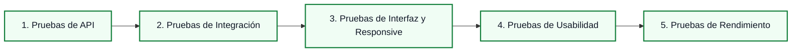

# Especificación Técnica Base — RuralConecta-Proyecto

> **Versión 3.0** — Actualización de la arquitectura backend para utilizar FastAPI (Python 3.10+), Pydantic y SQLAlchemy ORM, manteniendo JSP, HTML5, CSS3 y JavaScript Vanilla en el frontend y PostgreSQL como base de datos relacional.

## 1. Identificación del Proyecto

| Campo | Detalle |
|---|---|
| **Nombre del Proyecto** | RuralConecta-Proyecto |
| **Tipo de Aplicación** | Producto Mínimo Viable (MVP) — Aplicación Web Full Stack |
| **Contexto de Aplicación** | Comunidades y municipios rurales del departamento de Antioquia, Colombia |
| **Enfoque Arquitectónico** | Arquitectura desacoplada con Backend API REST y Frontend Web |
| **Estado del Documento** | Fase 0 — Análisis y Planificación |

---

## 2. Descripción de la Problemática

En las zonas rurales del departamento de Antioquia, los ciudadanos enfrentan importantes barreras para acceder a información oportuna, verídica y estructurada sobre los trámites y servicios esenciales prestados por entidades públicas, comunitarias y privadas.

La problemática se caracteriza por:

1. **Dispersión de la información**: Los datos sobre horarios de atención, sedes, requisitos y contactos se encuentran fragmentados en carteleras físicas municipales, redes sociales no oficiales o dependen del conocimiento informal de la comunidad.
2. **Costos y desplazamientos innecesarios**: La falta de claridad en los requisitos y horarios de atención obliga a los habitantes de veredas y corregimientos a realizar desplazamientos extensos y costosos hacia las cabeceras municipales, únicamente para consultar requisitos o encontrarse con dependencias cerradas.
3. **Brecha digital y de acceso**: La ausencia de plataformas centralizadas, ligeras y adaptadas a las condiciones de conectividad rural dificulta el ejercicio de derechos fundamentales en áreas como salud, educación, transporte y asistencia social.

---

## 3. Solución Propuesta

**RuralConecta-Proyecto** propone una aplicación web centralizada, accesible e intuitiva que organiza la oferta de servicios y trámites municipales mediante una estructura de consulta ágil y optimizada para dispositivos móviles y de escritorio.

El flujo de navegación se basa en tres pasos directos:
$$\text{Selección de Municipio} \longrightarrow \text{Selección de Categoría} \longrightarrow \text{Consulta de Servicios}$$

### Categorías Iniciales
- **Salud**: Puestos de salud, jornadas de vacunación, brigadas médicas, dispensarios y farmacias comunitarias.
- **Educación**: Sedes educativas rurales, programas de alfabetización, biblioteca municipal y capacitaciones técnicas.
- **Transporte**: Rutas de transporte veredal, frecuencias de escaleras/chivas, cooperativas y terminales locales.
- **Servicios públicos**: Puntos de atención de acueducto, energía, gas, recolección de residuos y reporte de fallas.
- **Apoyos sociales**: Subsidios, programas del adulto mayor, transferencias monetarias, banco de semillas y asistencia agrícola.

### Información Detallada por Servicio
Para cada servicio consultado, la plataforma presentará:
- **Nombre oficial**: Denominación clara del servicio o trámite.
- **Descripción**: Resumen conciso del propósito y alcance del servicio.
- **Municipio**: Municipio al que pertenece la sede o trámite.
- **Dirección / Ubicación**: Referencia física clara en cabecera o vereda.
- **Horarios de atención**: Días hábiles y franjas horarias de servicio.
- **Requisitos**: Lista estructurada de documentos o condiciones previas para acceder al servicio.
- **Canales de contacto**: Números de teléfono, líneas de WhatsApp, correos electrónicos o canales comunitarios.

---

## 4. Objetivo General

Centralizar y facilitar el acceso a la información de servicios y trámites municipales esenciales para las comunidades rurales del departamento de Antioquia a través del desarrollo de un MVP web Full Stack, responsivo y sustentado en una API REST desacoplada.

---

## 5. Alcance del MVP

### 5.1. Funcionalidades Dentro del Alcance
| Módulo / Característica | Descripción |
|---|---|
| **Catálogo de Municipios** | Consulta y selección de municipios rurales de Antioquia disponibles en la base de datos. |
| **Catálogo de Categorías** | Consulta y navegación por las 5 categorías esenciales definidas. |
| **Listado y Filtros de Servicios** | Búsqueda y filtrado dinámico de servicios combinando municipio y/o categoría. |
| **Ficha Detallada del Servicio** | Visualización estructurada de dirección, horarios, requisitos y datos de contacto. |
| **Consumo vía API REST** | Comunicación asíncrona entre cliente web y servidor mediante datos en formato JSON. |
| **Diseño Responsive** | Adaptabilidad completa para pantallas de teléfonos inteligentes, tabletas y computadores de escritorio. |

### 5.2. Funcionalidades Fuera del Alcance (Futuras Ampliaciones)
- Pasarelas o procesamiento de pagos en línea.
- Integraciones complejas con historias clínicas o sistemas médicos hospitalarios.
- Agendamiento real y reserva de citas médicas o administrativas.
- Integraciones directas y transaccionales con plataformas gubernamentales externas.
- Canales de chat o mensajería en tiempo real mediante WebSockets.
- Procesamiento de lenguaje natural o módulos de inteligencia artificial.
- Aplicación móvil nativa compilada (Android / iOS).
- Módulos administrativos avanzados con gestión multi-rol y auditoría en esta primera entrega.

---

## 6. Requisitos Funcionales

| ID | Nombre | Descripción | Prioridad |
|---|---|---|---|
| **RF-01** | Consultar municipios | El sistema debe permitir al usuario consultar el listado completo de municipios registrados. | Alta |
| **RF-02** | Consultar categorías | El sistema debe permitir consultar las categorías temáticas de servicios disponibles. | Alta |
| **RF-03** | Consultar servicios | El sistema debe listar los servicios registrados con su información básica de identificación. | Alta |
| **RF-04** | Filtrar por municipio | El sistema debe permitir filtrar el catálogo de servicios según el municipio seleccionado. | Alta |
| **RF-05** | Filtrar por categoría | El sistema debe permitir filtrar el catálogo de servicios según la categoría seleccionada. | Alta |
| **RF-06** | Visualizar detalle del servicio | El sistema debe mostrar la ficha técnica completa del servicio: nombre, descripción, municipio, dirección, horarios, requisitos y datos de contacto. | Alta |
| **RF-07** | Consumo estructurado JSON | La capa de presentación debe recibir e interpretar las respuestas de la API REST en formato JSON estándar. | Alta |

---

## 7. Requisitos No Funcionales

| ID | Categoría | Descripción | Criterio de Aceptación |
|---|---|---|---|
| **RNF-01** | **Rendimiento** | Tiempo de respuesta de las consultas principales a la API REST. | $\le 2.0\text{ segundos}$ en condiciones normales de conectividad. |
| **RNF-02** | **Usabilidad** | Simplicidad de interfaz orientada a usuarios con diferentes niveles de alfabetización digital. | Flujo de localización de servicios realizable en máximo 3 interacciones. |
| **RNF-03** | **Responsive Design** | Diseño adaptable a diferentes resoluciones de pantalla. | Visualización correcta en resoluciones móviles ($360\text{px}-768\text{px}$) y de escritorio ($\ge 1024\text{px}$). |
| **RNF-04** | **Seguridad** | Protección de la integridad de los datos y mitigación de vulnerabilidades comunes. | Uso estricto de ORM (anti-SQLi), sanitización de entradas y control CORS. |
| **RNF-05** | **Mantenibilidad** | Código limpio, modular y estructurado bajo estándares de separación de capas. | Estructura modular independiente para frontend, backend y documentación. |
| **RNF-06** | **Escalabilidad** | Capacidad arquitectónica para incorporar nuevos municipios, categorías y servicios. | Arquitectura desacoplada basada en API REST y modelo relacional normalizado. |
| **RNF-07** | **Disponibilidad** | Preparación para despliegue en entornos de ejecución web accesibles de forma continua. | Estructura de configuración externalizada mediante variables de entorno. |
| **RNF-08** | **Eficiencia en Datos** | Carga ligera de recursos frontend para mitigar limitaciones de conectividad rural. | CSS3 organizado y optimizado, JavaScript Vanilla sin frameworks pesados y payloads JSON compactos. |

---

## 8. Arquitectura Tecnológica

| Componente | Tecnología Seleccionada | Justificación |
|---|---|---|
| **Frontend — Presentación** | JSP (JavaServer Pages) | Tecnología principal para la construcción de vistas dinámicas y reutilizables mediante fragmentos `.jspf`. |
| **Frontend — Estructura** | HTML5 | Estructuración semántica de las páginas y contenido (header, nav, main, section, article, footer). |
| **Frontend — Estilos** | CSS3 | Diseño visual, Responsive Design (Flexbox, Grid, variables CSS, media queries). Tecnología oficial de estilos. |
| **Frontend — Lógica cliente** | JavaScript Vanilla | Interacción del usuario, manipulación del DOM, filtros, validaciones y consumo de la API REST mediante Fetch API. |
| **Backend** | Python + FastAPI + Pydantic + SQLAlchemy + Uvicorn | Framework web asíncrono y de alto rendimiento, esquemas tipados con Pydantic, ORM relacional SQLAlchemy y servidor ASGI Uvicorn. |
| **Base de Datos** | PostgreSQL | Motor relacional potente, confiable, con soporte íntegro para consultas estructuradas y relaciones normalizadas. |
| **Protocolo y Formato** | HTTP / HTTPS con payloads JSON | Estándar universal de comunicación desacoplada y ligera para aplicaciones web. |
| **Control de Versiones** | Git + GitHub | Gestión de código fuente, trazabilidad de commits y colaboración organizada. |
| **Despliegue** | Infraestructura Cloud (Proveedor pendiente) | Preparación desacoplada mediante variables de entorno y soporte para producción. |

---

## 9. Arquitectura Lógica

La arquitectura del sistema sigue un patrón multicapa desacoplado:

---

## 10. Modelo de Datos Preliminar

El modelo de datos se estructura alrededor de tres entidades relacionales principales:

### Entidades y Relaciones

1. **Municipio**: Representa las divisiones territoriales de Antioquia donde se prestan los servicios.
2. **Categoria**: Representa las áreas temáticas en las que se clasifican los servicios (Salud, Educación, etc.).
3. **Servicio**: Entidad central que contiene la información detallada del trámite o servicio. Está vinculada a un único **Municipio** y a una única **Categoría**.

### Diagrama Entidad-Relación Conceptual

---

## 11. API REST Preliminar

La API REST expondrá recursos bajo el prefijo `/api/`. A continuación se detalla la especificación conceptual de los endpoints previstos para el MVP:

| Método HTTP | Endpoint | Parámetros de Consulta (Query Params) | Descripción / Propósito |
|---|---|---|---|
| `GET` | `/api/municipios/` | Ninguno | Retorna el listado de municipios disponibles. |
| `GET` | `/api/municipios/{id}/` | Ninguno | Retorna el detalle de un municipio específico. |
| `GET` | `/api/categorias/` | Ninguno | Retorna el catálogo de categorías temáticas. |
| `GET` | `/api/categorias/{id}/` | Ninguno | Retorna el detalle de una categoría específica. |
| `GET` | `/api/servicios/` | `?municipio={id}&categoria={id}` | Retorna el listado de servicios, permitiendo filtrar por municipio, categoría o ambos. |
| `GET` | `/api/servicios/{id}/` | Ninguno | Retorna la ficha técnica y de contacto completa de un servicio particular. |

> *Nota: En esta fase inicial los endpoints se definen únicamente a nivel conceptual; no se implementará código de vistas ni enrutadores hasta la fase correspondiente.*

---

## 12. Seguridad

Durante todas las etapas de diseño e implementación del proyecto se aplicarán los siguientes principios y mecanismos de seguridad:

1. **Protección contra Inyección SQL**: Acceso exclusivo a la base de datos a través de SQLAlchemy ORM con sentencias preparadas y parametrizadas.
2. **Validación y Sanitización de Entradas**: Validación estricta de tipos de datos y esquemas mediante Pydantic antes de procesar las consultas.
3. **Mitigación de Cross-Site Scripting (XSS)**: En el Frontend JSP, se evitará insertar contenido no confiable directamente en las vistas. En JavaScript, se usará `textContent` en lugar de `innerHTML` sobre datos dinámicos provenientes de la API. Se sanitizarán las respuestas JSON antes de renderizarlas.
4. **Seguridad en Vistas JSP**: No se colocará lógica de negocio compleja directamente dentro de archivos JSP. Se validarán parámetros recibidos. No se expondrá información sensible en los fragmentos de presentación.
5. **Control de Orígenes Cruzados (CORS)**: Configuración restrictiva mediante `CORSMiddleware` en FastAPI, autorizando únicamente el origen del cliente web permitido.
6. **Gestión Segura de Secretos y Configuración**: Uso estricto de variables de entorno mediante `pydantic-settings` (`.env`) para almacenar claves secretas, cadenas de conexión a base de datos y configuraciones sensibles.
7. **Configuración Segura para Producción**: Deshabilitación de documentación interactiva pública en producción si se requiere y encabezados de seguridad HTTP.
8. **Política de Autenticación**: El MVP se enfocará en consultas públicas y abiertas para los ciudadanos. En caso de requerir módulos de administración o autenticación posterior, se evaluará la implementación de tokens JWT.

---

## 13. Métricas del Proyecto

Para validar objetivamente la calidad técnica y funcional del MVP, se definen las siguientes métricas cuantificables a verificar en fases avanzadas:

| Dimensión | Métrica | Meta / Indicador de Éxito | Método de Medición |
|---|---|---|---|
| **Rendimiento de API** | Tiempo de respuesta promedio en endpoints `GET`. | $< 2.0\text{ segundos}$ | Pruebas de carga y herramientas de red en navegador. |
| **Cobertura Funcional** | Porcentaje de requisitos funcionales del MVP implementados y operativos. | $100\%$ de los RF planificados (`RF-01` a `RF-07`). | Matriz de trazabilidad y lista de verificación de requisitos. |
| **Eficacia de Usabilidad** | Tasa de éxito en la localización de un servicio en el flujo de 3 pasos. | $\ge 90\%$ de tareas completadas exitosamente. | Pruebas de usabilidad con usuarios de prueba. |
| **Cumplimiento Cronológico** | Nivel de avance respecto al cronograma del taller/proyecto. | Ejecución conforme a las fases 0 a 6. | Registro de tareas y commits en el repositorio. |

> *Nota: Los resultados numéricos se registrarán exclusivamente tras la ejecución de pruebas reales.*

---

## 14. Estrategia de Pruebas

La calidad del sistema se garantizará mediante la ejecución progresiva de los siguientes tipos de pruebas:

1. **Pruebas de API (Backend)**:
   - Verificación de códigos de estado HTTP (`200 OK`, `400 Bad Request`, `404 Not Found`).
   - Validación de estructura de respuesta JSON y filtros por municipio y categoría mediante `TestClient` de FastAPI y Pytest.
2. **Pruebas de Integración (Frontend — Backend)**:
   - Comprobación del ciclo completo de petición y renderización de datos dinámicos mediante `fetch`.
   - Manejo adecuado de estados de carga (*loading*) y estados de error/sin resultados.
3. **Pruebas de Interfaz y Responsive Design**:
   - Inspección visual en breakpoints móviles ($360\text{px}$, $412\text{px}$, $768\text{px}$) y de escritorio ($1024\text{px}$, $1440\text{px}$).
   - Verificación de legibilidad tipográfica y áreas táctiles de botones.
4. **Pruebas de Usabilidad**:
   - Evaluación del flujo directo: *Municipio → Categoría → Servicio*.
5. **Pruebas de Rendimiento**:
   - Medición de latencia de red, tiempo de renderizado y peso total de la transferencia de datos.

---

## 15. Estrategia de Despliegue

La solución se diseñará bajo lineamientos de despliegue desacoplado en la nube:

- **Estructura Desacoplada**: Posibilidad de desplegar el backend (API FastAPI con Uvicorn/Gunicorn) y el frontend (sitio JSP/cliente web) de forma independiente.
- **Configuración por Entorno**: Parametrización externa de variables (`DATABASE_URL`, `DEBUG`, `ALLOWED_HOSTS`, `CORS_ALLOWED_ORIGINS`).
- **Base de Datos Gestionada**: Uso de instancia PostgreSQL administrada en la nube para persistencia segura.
- **Servicio de Archivos Estáticos**: Preparación mediante `WhiteNoise` o almacenamiento de objetos para producción.
- **Selección de Proveedor**: La infraestructura específica (PaaS / IaaS) se definirá y configurará en la **Fase 5 (Despliegue)**.

---

## 16. Limitaciones y Futuras Ampliaciones

El alcance actual está acotado al MVP para garantizar entrega ágil y estabilidad funcional. Se identifican como posibles extensiones para fases posteriores:

1. **Módulo de Autenticación y Roles**: Acceso diferenciado para administradores municipales y líderes comunitarios.
2. **Panel de Gestión de Contenidos (Backoffice)**: Interfaz web administrativa para que funcionarios locales actualicen y publiquen servicios directamente.
3. **Integración con Mapas y Geolocalización**: Visualización interactiva de sedes de servicios en mapas comunitarios con soporte fuera de línea.
4. **Sistema de Notificaciones Comunitarias**: Alertas vía SMS o mensajería sobre jornadas especiales (vacunación, brigadas, pagos de subsidios).
5. **Aplicación Móvil Nativa / PWA**: Capacidad de funcionamiento sin conexión (*offline-first*) para veredas con conectividad nula.
6. **Módulo de Agendamiento y Trámites en Línea**: Solicitud de turnos y radicación de solicitudes directas cuando las condiciones institucionales lo permitan.

---

## 17. Control de Cambios

| Versión | Fecha | Descripción | Responsable |
|---|---|---|---|
| 1.0 | 2026-08-18 | Creación de la especificación técnica inicial del proyecto. | Equipo RuralConecta |
| 2.0 | 2026-08-19 | Actualización de la arquitectura frontend para utilizar JSP, HTML5, CSS3 y JavaScript Vanilla. Eliminación de Tailwind CSS. Mantenimiento de Django, DRF y PostgreSQL como componentes principales del backend y persistencia. | Equipo RuralConecta |
| 3.0 | 2026-08-19 | Migración de la arquitectura backend de Django/DRF a FastAPI (Python 3.10+), Pydantic, SQLAlchemy 2.0 y servidor ASGI Uvicorn, conservando el frontend JSP y la base de datos PostgreSQL. | Equipo RuralConecta |
