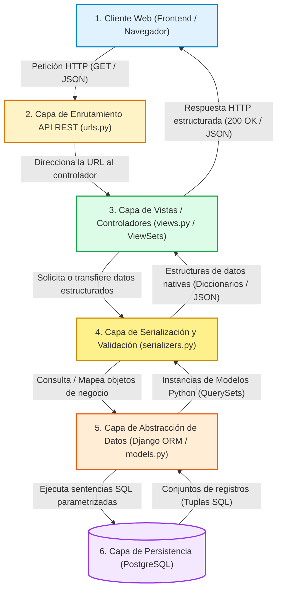

# Estructura del Backend — RuralConecta-Proyecto

## 1. Objetivo

El objetivo de este documento es definir el **diseño de la arquitectura interna del Backend** para el Producto Mínimo Viable (MVP) de **RuralConecta-ProyectoWeb**.

Dentro de la arquitectura desacoplada general del sistema, el backend cumple la función de **capa de servicios centralizada y proveedora de datos**. Es el componente responsable de:

- Gestionar la lógica de negocio y las reglas de validación de datos.
- Proveer una interfaz de comunicación estructurada y estándar mediante una **API REST** para el consumo del frontend.
- Administrar el acceso seguro, normalizado y eficiente a la base de datos relacional (**PostgreSQL**).
- Aislar el cliente web de los detalles de almacenamiento físico, garantizando consistencia, integridad y seguridad en todas las consultas de municipios, categorías y servicios rurales.

---

## 2. Tecnologías

El backend se construirá sobre un ecosistema tecnológico maduro, seguro y altamente escalable en el lenguaje Python:

| Tecnología | Rol en la Arquitectura | Función Principal |
|---|---|---|
| **Python** | Lenguaje de programación base | Proporciona una sintaxis limpia, legible y un ecosistema robusto para el desarrollo web rápido y mantenible. |
| **Django** | Framework web principal | Provee la estructura general del proyecto, el sistema de enrutamiento, la gestión de configuración, el panel administrativo y los mecanismos de seguridad nativos. |
| **Django REST Framework (DRF)** | Toolkit para construcción de APIs | Facilita la creación de endpoints RESTful, transformación y validación de tipos de datos mediante serializadores, y estandarización de respuestas en formato JSON. |
| **Django ORM** | Mapeador Objeto-Relacional | Permite interactuar con la base de datos relacional mediante clases y objetos Python, abstrayendo las sentencias SQL y previniendo inyecciones de código malicioso. |
| **PostgreSQL** | Motor de base de datos relacional | Almacena y persiste de forma confiable, transaccional y normalizada las entidades del sistema (`Municipio`, `Categoria`, `Servicio`). |

---

## 3. Arquitectura Interna

La arquitectura interna del backend sigue un patrón multicapa modular y desacoplado, donde cada componente tiene una responsabilidad específica e interactúa de manera secuencial con el siguiente:



### Descripción del Flujo Interno

1. **Cliente**: El navegador o aplicación cliente realiza una solicitud HTTP asíncrona hacia un endpoint público.
2. **API REST (`urls.py`)**: El sistema de enrutamiento de Django analiza el path de la URL y delega la ejecución a la vista correspondiente.
3. **Views / ViewSets (`views.py`)**: La vista recibe la solicitud, procesa los parámetros de búsqueda o filtrado (`Query Params`), orquesta la lógica necesaria y solicita la información al ORM.
4. **Serializers (`serializers.py`)**: Valida los datos recibidos y transforma los objetos del modelo a formato JSON (o viceversa) asegurando el esquema de salida.
5. **Django ORM (`models.py`)**: Construye y ejecuta consultas seguras y optimizadas contra la base de datos utilizando el modelo de dominio.
6. **PostgreSQL**: Ejecuta la consulta relacional sobre las tablas correspondientes y retorna los registros al ORM.

---

## 4. Estructura de Carpetas Propuesta

Para mantener una organización limpia, escalable y adaptada a la simplicidad requerida por el MVP, se propone la siguiente estructura de directorios para el backend:

```text
backend/
├── manage.py                   # Script de gestión y utilidades CLI de Django
├── requirements.txt            # Declaración de dependencias del backend Python
├── .env.example                # Plantilla de variables de entorno requeridas
│
├── config/                     # Paquete principal de configuración del proyecto
│   ├── __init__.py
│   ├── asgi.py                 # Punto de entrada para servidores ASGI
│   ├── wsgi.py                 # Punto de entrada para servidores WSGI
│   ├── urls.py                 # Enrutador principal y prefijo global /api/
│   └── settings/               # Modularización de configuraciones
│       ├── __init__.py
│       ├── base.py             # Configuraciones comunes (apps, middleware, templates)
│       ├── local.py            # Configuración para entorno de desarrollo local
│       └── production.py       # Configuración segura para entorno de despliegue
│
└── servicios/                  # Aplicación Django principal del MVP
    ├── __init__.py
    ├── apps.py                 # Metadatos de inicialización de la app
    ├── models.py               # Definición de entidades (Municipio, Categoria, Servicio)
    ├── serializers.py          # Serializadores para transformar y validar datos JSON
    ├── views.py                # Vistas y ViewSets de la API REST
    ├── urls.py                 # Enrutamiento específico de recursos (/municipios, /categorias, /servicios)
    ├── admin.py                # Configuración del panel de administración Django
    └── tests/                  # Directorio modular de pruebas automatizadas
        ├── __init__.py
        ├── test_models.py      # Pruebas unitarias para modelos y restricciones
        ├── test_serializers.py # Pruebas para validación y serialización
        └── test_views.py       # Pruebas para endpoints HTTP y filtros de búsqueda
```

> **Criterio de Organización**: Se centralizan las tres entidades del MVP (`Municipio`, `Categoria`, `Servicio`) en una aplicación unificada (`servicios`) para evitar sobreingeniería en esta fase inicial, manteniendo al mismo tiempo una separación modular de configuraciones y pruebas.

---

## 5. Responsabilidad de Cada Componente

Cada archivo y módulo dentro del backend cumple una responsabilidad estricta dentro del patrón arquitectónico:

| Componente | Archivo / Directorio | Responsabilidad Principal |
|---|---|---|
| **Modelos** | `servicios/models.py` | Define la estructura de las entidades relacionales (`Municipio`, `Categoria`, `Servicio`), tipos de datos, restricciones de integridad referencial (`PROTECT`, `NOT NULL`, `UNIQUE`) y métodos del modelo (`__str__`). |
| **Serializadores** | `servicios/serializers.py` | Convierte instancias de modelos complejos en tipos de datos nativos de Python convertibles a JSON. Aplica validaciones de formato y controla los campos expuestos hacia el cliente. |
| **Vistas** | `servicios/views.py` | Contiene los controladores que reciben las peticiones HTTP (`GET`), coordinan la consulta con el ORM, aplican lógica de filtrado por parámetros (ej. `?municipio=X&categoria=Y`) y retornan respuestas con códigos de estado HTTP apropiados (`200 OK`, `404 Not Found`). |
| **Enrutadores** | `servicios/urls.py` y `config/urls.py` | Mapea las URLs solicitadas por el cliente con las vistas correspondientes, asegurando la estructura estandarizada bajo el prefijo `/api/`. |
| **Pruebas** | `servicios/tests/` | Aloja las suites de pruebas automatizadas unitarias y de integración para validar la integridad de los modelos, la correcta serialización de datos y el comportamiento de los endpoints. |
| **Configuraciones** | `config/settings/` | Gestiona los parámetros del entorno de ejecución (bases de datos, CORS, aplicaciones instaladas, seguridad, variables de entorno) diferenciando desarrollo local de producción. |
| **Gestor CLI** | `manage.py` | Utilidad de línea de comandos de Django para ejecutar tareas administrativas como migraciones (`makemigrations`, `migrate`), ejecución de pruebas (`test`) y arranque del servidor local (`runserver`). |

---

## 6. Flujo Detallado de una Petición

A continuación se ilustra el ciclo de vida completo paso a paso para una consulta típica de catálogo de servicios:

$$\text{Petición}: \quad \mathbf{GET} \quad \texttt{/api/servicios/?municipio=1&categoria=3}$$

```text
[1. Navegador Web]
       │  Petición HTTP: GET /api/servicios/?municipio=1&categoria=3
       ▼
[2. config/urls.py]
       │  Detecta prefijo '/api/' y delega en 'servicios.urls'
       ▼
[3. servicios/urls.py]
       │  Enruta la ruta 'servicios/' hacia 'ServicioViewSet' o 'ServicioListView'
       ▼
[4. servicios/views.py]
       │  - Extrae parámetros: municipio_id = 1, categoria_id = 3
       │  - Construye consulta ORM: Servicio.objects.filter(municipio_id=1, categoria_id=3)
       ▼
[5. Django ORM]
       │  Genera SQL parametrizado:
       │  SELECT * FROM servicios_servicio WHERE municipio_id = 1 AND categoria_id = 3;
       ▼
[6. PostgreSQL]
       │  Ejecuta consulta sobre índices y retorna registros
       ▼
[7. Django ORM]
       │  Convierte registros en QuerySet de instancias del modelo Servicio
       ▼
[8. servicios/serializers.py]
       │  Toma el QuerySet y genera lista de diccionarios con campos seleccionados:
       │  [{"id": 2, "nombre": "Cooperativa...", "municipio": 1, ...}]
       ▼
[9. servicios/views.py]
       │  Empaqueta los datos en un objeto Response(status=200)
       ▼
[10. Navegador Web]
       │  Recibe payload JSON y procede a renderizar las tarjetas en la interfaz
```

---

## 7. Separación de Responsabilidades

Para asegurar un código altamente legible, testeable y mantenible a largo plazo, la arquitectura aplica el principio de **Separación de Responsabilidades (SoC - Separation of Concerns)**:

1. **Desacoplamiento entre Presentación y Persistencia**: Las vistas (`views.py`) no ejecutan sentencias SQL directas ni conocen los detalles internos del motor de base de datos; interactúan exclusivamente a través de la interfaz del ORM (`models.py`).
2. **Independencia en la Representación de Datos**: La capa de serialización (`serializers.py`) actúa como un contrato explícito de datos entre el backend y el frontend, permitiendo cambiar detalles internos de los modelos sin romper la estructura JSON consumida por el cliente.
3. **Aislamiento de la Configuración**: La lógica de negocio y las aplicaciones no contienen credenciales fijas (*hardcoded*), dependiendo exclusivamente de la inyección de configuración mediante variables de entorno en `config/settings/`.
4. **Enrutamiento Jerárquico**: Cada aplicación gestiona sus propias rutas internas (`servicios/urls.py`), manteniendo el enrutador principal (`config/urls.py`) limpio y enfocado en la orquestación global.

---

## 8. Seguridad

La arquitectura del backend integra de forma nativa las medidas de seguridad estipuladas en la especificación técnica del proyecto, sin agregar elementos fuera del alcance del MVP:

- **Protección contra Inyección SQL**: El acceso a la base de datos se realiza de forma exclusiva a través del **ORM de Django**, el cual parametriza y escapa automáticamente todas las consultas contra PostgreSQL.
- **Validación Estricta de Entradas**: Los **Serializadores de DRF** validan tipos de datos, longitudes máximas y obligatoriedad de campos antes de cualquier operación lógica, rechazando parámetros malformados.
- **Control de Acceso Cruzado (CORS)**: Implementación de `django-cors-headers` en la configuración para autorizar únicamente el origen del cliente web permitido, bloqueando peticiones no autorizadas desde otros dominios.
- **Gestión de Credenciales mediante Variables de Entorno**: La clave secreta (`SECRET_KEY`), credenciales de base de datos y configuraciones sensibles se leen desde archivos `.env` (no versionados en Git), evitando la exposición accidental de secretos.
- **Configuración Segura de Django**: Diferenciación de entornos para garantizar que en producción `DEBUG = False`, `ALLOWED_HOSTS` esté estrictamente definido y se activen encabezados de seguridad HTTP estándar.

---

## 9. Preparación para Pruebas

La arquitectura prevé una infraestructura organizada para la ejecución de pruebas automatizadas durante la fase de desarrollo:

- **Ubicación**: Las pruebas se alojarán en el subdirectorio `servicios/tests/` para facilitar su categorización.
- **Pruebas de Modelos (`test_models.py`)**: Verificación de la creación de registros, restricciones `UNIQUE`, obligatoriedad de campos y relaciones de clave foránea con protección contra borrado (`PROTECT`).
- **Pruebas de Serializadores (`test_serializers.py`)**: Validación de la estructura de los campos serializados y comprobación del correcto rechazo de datos inválidos.
- **Pruebas de API y Vistas (`test_views.py`)**: Uso de `APITestCase` de Django REST Framework para comprobar:
  - Códigos de respuesta HTTP (`200 OK`, `404 Not Found`).
  - Formato y exactitud del payload JSON de retorno.
  - Funcionamiento correcto de los filtros combinados (`?municipio={id}&categoria={id}`).
- **Ejecución**: Se utilizará el ejecutor nativo de Django mediante el comando estándar de gestión:
  $$\texttt{python manage.py test}$$

---

## 10. Preparación para Despliegue

La estructura propuesta está diseñada para facilitar el despliegue desacoplado en plataformas en la nube (PaaS / IaaS) en fases posteriores:

1. **Modularización de Settings**:
   - `config/settings/base.py`: Parámetros comunes de la aplicación.
   - `config/settings/local.py`: Configuración para desarrollo local (base de datos local/SQLite/PostgreSQL de prueba, `DEBUG = True`).
   - `config/settings/production.py`: Configuración para entorno en la nube (`DEBUG = False`, lectura obligatoria de variables de entorno).
2. **Externalización Total de la Configuración**:
   - Soporte para variables como `DATABASE_URL`, `SECRET_KEY`, `ALLOWED_HOSTS` y `CORS_ALLOWED_ORIGINS`.
3. **Compatibilidad con Servidores de Producción**:
   - Archivo `wsgi.py` preparado para ser servido por servidores de aplicaciones como **Gunicorn**.
4. **Gestión de Archivos Estáticos**:
   - Preparación para servir archivos estáticos del panel de administración mediante librerías como **WhiteNoise** en entornos sin servidor web dedicado.

---

## 11. Estado del Documento

```text
Fase: 0 — Análisis y planificación
Estado: Diseño de arquitectura backend
Implementación: Pendiente
```
