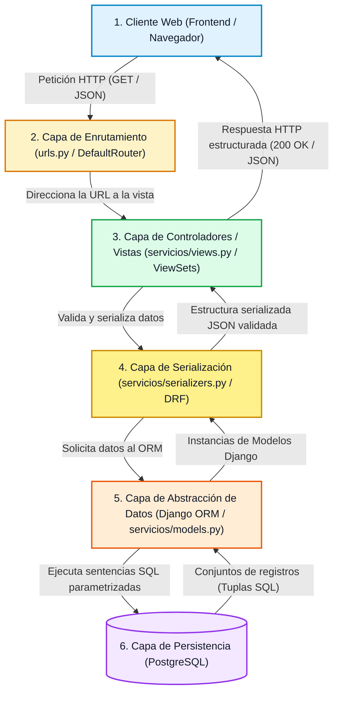
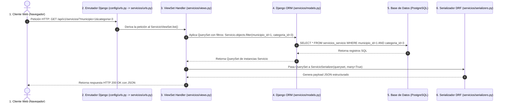

# Estructura del Backend — RuralConecta-Proyecto

## 1. Objetivo

El objetivo de este documento es definir el **diseño de la arquitectura interna del Backend** para el Producto Mínimo Viable (MVP) de **RuralConecta-ProyectoWeb**.

Dentro de la arquitectura desacoplada general del sistema, el backend cumple la función de **capa de servicios centralizada y proveedora de datos**. Es el componente responsable de:

- Gestionar la lógica de negocio y las reglas de validación de datos.
- Proveer una interfaz de comunicación estructurada y estándar mediante una **API REST** para el consumo del frontend.
- Administrar el acceso seguro, normalizado y eficiente a la base de datos relacional (**PostgreSQL**).
- Aislar el cliente web de los detalles de almacenamiento físico, garantizando consistencia, integridad y seguridad en todas las consultas de municipios, categorías y servicios rurales.

---

## 2. Tecnologías

El backend se construirá sobre un ecosistema tecnológico maduro, seguro y altamente escalable en el lenguaje Python utilizando el framework web Django y Django REST Framework:

| Tecnología | Rol en la Arquitectura | Función Principal |
|---|---|---|
| **Python** | Lenguaje de programación base | Proporciona una sintaxis limpia, legible y tipada (Python 3.10+) para el desarrollo web rápido y mantenible. |
| **Django** | Framework web principal | Provee la estructura sólida del proyecto, enrutamiento, ORM, motor de migraciones, seguridad y panel de administración nativo. |
| **Django REST Framework (DRF)** | Toolkit para API REST | Permite construir APIs RESTful, serializadores (`ModelSerializer`), vistas basadas en clases/ViewSets y documentación interactiva. |
| **Django ORM** | Mapeador Objeto-Relacional (ORM) | Permite interactuar con la base de datos relacional mediante clases Python (`models.Model`), consultas parametrizadas y migraciones automatizadas. |
| **WSGI / Gunicorn** | Servidor de aplicaciones | Servidor de producción estándar para ejecutar la aplicación web Django. |
| **PostgreSQL** | Motor de base de datos relacional | Almacena y persiste de forma confiable, transaccional y normalizada las entidades del sistema (`Municipio`, `Categoria`, `Servicio`). |

---

## 3. Arquitectura Interna

La arquitectura interna del backend sigue un patrón multicapa modular y desacoplado basada en Django REST Framework, donde cada componente tiene una responsabilidad específica e interactúa de manera secuencial con el siguiente:



### Descripción del Flujo Interno

1. **Cliente**: El navegador o aplicación cliente realiza una solicitud HTTP asíncrona hacia un endpoint público (`GET /api/v1/servicios/`).
2. **Enrutamiento (`urls.py`)**: El enrutador de Django REST Framework (`DefaultRouter`) analiza la URL y deriva la solicitud a la vista o `ViewSet` correspondiente.
3. **Controladores / Vistas (`views.py`)**: La vista recibe la solicitud (`request`), extrae los parámetros de consulta (`query_params`), aplica los filtros requeridos (`municipio`, `categoria`) y consulta el `QuerySet` del modelo.
4. **Serializadores (`serializers.py`)**: DRF serializa las instancias del modelo Django ORM a objetos Python y construye el payload final en formato JSON.
5. **Django ORM (`models.py`)**: Ejecuta consultas SQL seguras y parametrizadas sobre PostgreSQL.
6. **PostgreSQL**: Procesa la consulta y retorna las tuplas almacenadas en la base de datos relacional.

---

## 4. Estructura de Carpetas Propuesta

Para mantener una organización limpia, modular y mantenible adaptada al estándar de Django y DRF, se propone la siguiente estructura de directorios para el backend:

```text
backend/
├── manage.py                   # Script de gestión CLI de Django
├── requirements.txt            # Declaración de dependencias Python (django, djangorestframework, psycopg2-binary, django-cors-headers)
├── .env.example                # Plantilla de variables de entorno requeridas
│
├── config/                     # Configuración global del proyecto Django
│   ├── __init__.py
│   ├── settings.py             # Configuración principal (DATABASES, INSTALLED_APPS, CORS, REST_FRAMEWORK)
│   ├── urls.py                 # Enrutador principal de URLs del proyecto
│   ├── wsgi.py                 # Punto de entrada WSGI para servidores de producción (Gunicorn)
│   └── asgi.py                 # Punto de entrada ASGI
│
└── servicios/                  # Aplicación Django principal para la gestión del catálogo
    ├── __init__.py
    ├── admin.py                # Configuración del panel de administración nativo de Django
    ├── apps.py                 # Configuración de la app servicios
    ├── models.py               # Modelos de datos relacionales Django ORM (Municipio, Categoria, Servicio)
    ├── serializers.py          # Serializadores DRF (ModelSerializer para cada entidad)
    ├── views.py                # Vistas y ViewSets de la API REST (ModelViewSet / ReadOnlyModelViewSet)
    ├── urls.py                 # Enrutadores secundarios de la app servicios (/api/v1/)
    ├── migrations/             # Archivos de migración de base de datos de Django
    │   └── __init__.py
    └── tests/                  # Directorio de pruebas unitarias y de API (APITestCase)
        ├── __init__.py
        ├── test_models.py      # Pruebas de modelos de Django ORM
        ├── test_serializers.py # Pruebas de serialización DRF
        └── test_api.py         # Pruebas de endpoints HTTP y filtros con APITestCase
```

> **Criterio de Organización**: La aplicación sigue el estándar oficial de Django, separando la configuración del proyecto (`config/`) de la aplicación de dominio (`servicios/`), manteniendo en ella los modelos (`models.py`), serializadores (`serializers.py`), vistas (`views.py`) y pruebas (`tests/`).

---

## 5. Responsabilidad de Cada Componente

Cada archivo y módulo dentro del backend cumple una responsabilidad estricta dentro del patrón arquitectónico:

| Componente | Archivo / Directorio | Responsabilidad Principal |
|---|---|---|
| **Modelos** | `servicios/models.py` | Defines las entidades relacionales de Django ORM (`Municipio`, `Categoria`, `Servicio`), campos (`CharField`, `TextField`, `ForeignKey`), metadatos y métodos (`__str__`). |
| **Serializadores** | `servicios/serializers.py` | Convierte las instancias de Django ORM a JSON y viceversa mediante `serializers.ModelSerializer`, aplicando validaciones de campos. |
| **Vistas** | `servicios/views.py` | Contiene los ViewSets que reciben peticiones HTTP (`GET`), gestionan la lógica de filtrado por query params (`?municipio={id}&categoria={id}`) y retornan respuestas estructuradas. |
| **Enrutamiento** | `servicios/urls.py` | Registra las rutas de la API REST utilizando `DefaultRouter` de DRF bajo el prefijo `/api/v1/`. |
| **Configuraciones** | `config/settings.py` | Gestiona la conexión a PostgreSQL, aplicaciones instaladas, middleware de CORS (`django-cors-headers`) y configuraciones de Django REST Framework. |
| **Pruebas** | `servicios/tests/` | Aloja suites de pruebas automatizadas con `APITestCase` para validar modelos, serializadores, endpoints y filtros. |

---

## 6. Flujo Detallado de una Petición

A continuación se ilustra el ciclo de vida completo paso a paso para una consulta típica del catálogo de servicios:

> **Petición HTTP de Ejemplo**: `GET /api/v1/servicios/?municipio=1&categoria=3`



### Descripción Paso a Paso del Ciclo de Vida

| Paso | Componente | Acción / Responsabilidad |
|---|---|---|
| **1** | **Navegador Web** | El usuario aplica los filtros en la interfaz web; el frontend emite la petición asíncrona: `GET /api/v1/servicios/?municipio=1&categoria=3`. |
| **2** | **`servicios/urls.py`** | El `DefaultRouter` de DRF mapea la URL `/api/v1/servicios/` a la acción `list()` de `ServicioViewSet`. |
| **3** | **`servicios/views.py`** | `ServicioViewSet` extrae los `request.query_params` (`municipio`, `categoria`) y filtra el `QuerySet` inicial. |
| **4** | **Django ORM** | Traduce la consulta del `QuerySet` a una sentencia SQL parametrizada: `SELECT * FROM servicios_servicio WHERE municipio_id = 1 AND categoria_id = 3;`. |
| **5** | **PostgreSQL** | Ejecuta la consulta SQL sobre la base de datos relacional y retorna los datos correspondientes. |
| **6** | **Django ORM** | Transforma los registros SQL en un `QuerySet` de objetos Python `Servicio`. |
| **7** | **DRF Serializers** | Convierte el `QuerySet` en listas de objetos Python serializables a JSON mediante `ServicioSerializer`. |
| **8** | **Django REST Framework** | Empaqueta la respuesta con `Content-Type: application/json` y código HTTP `200 OK`. |
| **9** | **Navegador Web** | Recibe el payload JSON y renderiza dinámicamente las tarjetas de servicios. |

---

## 7. Separación de Responsabilidades

Para asegurar un código altamente legible, testeable y mantenible a largo plazo, la arquitectura aplica el principio de **Separación de Responsabilidades (SoC - Separation of Concerns)**:

1. **Desacoplamiento entre Presentación y Persistencia**: Las vistas y serializadores de DRF interactúan exclusivamente con la capa de modelos de Django ORM, abstrayendo las consultas SQL directas.
2. **Independencia en la Representación de Datos**: La capa de serializadores (`servicios/serializers.py`) actúa como un contrato explícito de datos entre el backend y el frontend, permitiendo modificar campos internos del ORM sin alterar el formato JSON entregado al cliente.
3. **Aislamiento de la Configuración**: Las variables de entorno y parámetros de ejecución se gestionan mediante `config/settings.py` leyendo valores desde archivos `.env` (vía `python-decouple` o similar).
4. **Enrutamiento Modular**: La aplicación `servicios` gestiona de forma autónoma sus URLs y componentes de negocio.

---

## 8. Seguridad

La arquitectura del backend integra las siguientes medidas de seguridad en Django y DRF:

- **Protección contra Inyección SQL**: Acceso parametrizado exclusivo mediante el **ORM de Django**.
- **Validación Estricta de Entradas**: Validación de datos e inspección de esquemas mediante **Serializadores DRF** antes de procesar la solicitud.
- **Control de Acceso Cruzado (CORS)**: Configuración del paquete `django-cors-headers` para restringir los orígenes web autorizados.
- **Gestión Segura de Credenciales**: Uso de variables de entorno para cargar cadenas de conexión a PostgreSQL, `SECRET_KEY` y configuraciones desde el archivo `.env`.

---

## 9. Preparación para Pruebas

La infraestructura de pruebas utiliza el framework de testing nativo de Django y **Django REST Framework (`APITestCase`)**:

- **Ubicación**: Subdirectorio `servicios/tests/`.
- **Pruebas de Modelos (`test_models.py`)**: Validación de creación de registros relacionales y restricciones.
- **Pruebas de Serializadores (`test_serializers.py`)**: Verificación de validez y campos serializados.
- **Pruebas de API (`test_api.py`)**: Uso de `APITestCase` de DRF para verificar respuestas HTTP `200 OK`, `404 Not Found` y filtros combinados.
- **Ejecución**:
  $$\texttt{python manage.py test servicios}$$

---

## 10. Preparación para Despliegue

1. **Configuración WSGI**:
   - Punto de entrada en `config/wsgi.py`.
   - Ejecución en producción mediante servidores WSGI como **Gunicorn** (`gunicorn config.wsgi:application --bind 0.0.0.0:8000`).
2. **Configuración de Producción**:
   - `DEBUG = False`.
   - Parametrización segura de `ALLOWED_HOSTS` y `CORS_ALLOWED_ORIGINS`.

---

## 11. Estado del Documento

```text
Fase: 0 — Análisis y planificación
Estado: Diseño de arquitectura backend Django/DRF
Implementación: Pendiente
```
