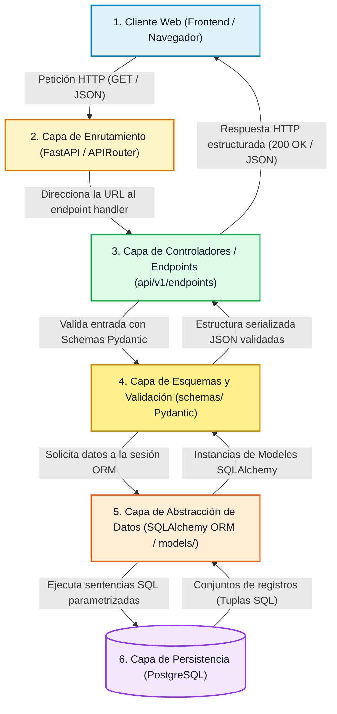
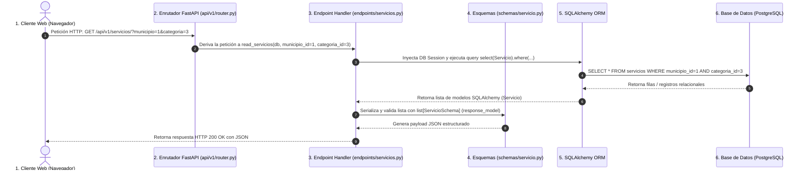

# Estructura del Backend — RuralConecta-Proyecto

## 1. Objetivo

El objetivo de este documento es definir el **diseño de la arquitectura interna del Backend** para el Producto Mínimo Viable (MVP) de **RuralConecta-ProyectoWeb**.

Dentro de la arquitectura desacoplada general del sistema, el backend cumple la función de **capa de servicios centralizada y proveedora de datos**. Es el componente responsable de:

- Gestionar la lógica de negocio y las reglas de validación de datos.
- Proveer una interfaz de comunicación estructurada y estándar mediante una **API REST** para el consumo del frontend.
- Administrar el acceso seguro, normalizado y eficiente a la base de datos relacional (**PostgreSQL**).
- Aislar el cliente web de los detalles de almacenamiento físico, garantizando consistencia, integridad y seguridad en todas las consultas de municipios, categorías y servicios rurales.

---

## 2. Tecnologías

El backend se construirá sobre un ecosistema tecnológico maduro, seguro y altamente escalable en el lenguaje Python:

| Tecnología | Rol en la Arquitectura | Función Principal |
|---|---|---|
| **Python** | Lenguaje de programación base | Proporciona una sintaxis limpia, legible, asíncrona y tipada (Python 3.10+) para el desarrollo web rápido y mantenible. |
| **FastAPI** | Framework web principal | Provee la estructura asíncrona de alto rendimiento para construir APIs RESTful, enrutamiento modular (`APIRouter`) y documentación interactiva automática (OpenAPI/Swagger). |
| **Pydantic** | Validación y Serialización | Valida y serializa esquemas de entrada y salida mediante tipos nativos de Python (`BaseModel`), garantizando contratos de datos estrictos en formato JSON. |
| **SQLAlchemy** | Mapeador Objeto-Relacional (ORM) | Permite interactuar con la base de datos relacional mediante clases y objetos Python (SQLAlchemy 2.0), ejecuciones parametrizadas y abstracción de sentencias SQL. |
| **Uvicorn** | Servidor ASGI | Servidor de producción y desarrollo asíncrono ultra-rápido para ejecutar la aplicación FastAPI. |
| **PostgreSQL** | Motor de base de datos relacional | Almacena y persiste de forma confiable, transaccional y normalizada las entidades del sistema (`Municipio`, `Categoria`, `Servicio`). |

---

## 3. Arquitectura Interna

La arquitectura interna del backend sigue un patrón multicapa modular y desacoplado, donde cada componente tiene una responsabilidad específica e interactúa de manera secuencial con el siguiente:



### Descripción del Flujo Interno

1. **Cliente**: El navegador o aplicación cliente realiza una solicitud HTTP asíncrona hacia un endpoint público.
2. **API REST (`APIRouter`)**: El enrutador de FastAPI analiza el path de la URL y mapea la solicitud al controlador correspondiente.
3. **Endpoints (`api/v1/endpoints/`)**: La función controladora recibe la solicitud, extrae los parámetros de consulta (`Query Params`) inyectados mediante dependencias (`Depends`), y coordina la lógica de negocio.
4. **Pydantic Schemas (`schemas/`)**: Valida automáticamente los parámetros de entrada y filtra la estructura de salida JSON de acuerdo al `response_model` configurado.
5. **SQLAlchemy ORM (`models/`)**: Ejecuta consultas relacionales seguras mediante la sesión de base de datos (`SessionLocal`) contra PostgreSQL.
6. **PostgreSQL**: Ejecuta la consulta SQL parametrizada sobre las tablas correspondientes y retorna las tuplas resultantes.

---

## 4. Estructura de Carpetas Propuesta

Para mantener una organización limpia, escalable y adaptada a la simplicidad requerida por el MVP, se propone la siguiente estructura de directorios para el backend:

```text
backend/
├── requirements.txt            # Declaración de dependencias Python (fastapi, uvicorn, sqlalchemy, pydantic, psycopg2)
├── .env.example                # Plantilla de variables de entorno requeridas
├── main.py                     # Punto de entrada de la aplicación FastAPI
│
└── app/                        # Paquete modular de la aplicación
    ├── __init__.py
    ├── main.py                 # Instancia principal de FastAPI, CORS middleware e inclusión de enrutadores
    ├── core/                   # Configuraciones globales y seguridad
    │   ├── __init__.py
    │   └── config.py           # Gestión de settings con Pydantic BaseSettings (.env)
    ├── db/                     # Gestión de conexión a base de datos
    │   ├── __init__.py
    │   ├── session.py          # Conexión SQLAlchemy (engine y SessionLocal)
    │   └── base.py             # Clase base declarativa para modelos
    ├── models/                 # Modelos de datos relacionales (SQLAlchemy)
    │   ├── __init__.py
    │   ├── municipio.py
    │   ├── categoria.py
    │   └── servicio.py
    ├── schemas/                # Esquemas de validación y serialización (Pydantic)
    │   ├── __init__.py
    │   ├── municipio.py
    │   ├── categoria.py
    │   └── servicio.py
    ├── api/                    # Enrutadores y endpoints de la API REST
    │   ├── __init__.py
    │   └── v1/
    │       ├── __init__.py
    │       ├── router.py       # APIRouter principal para la versión v1
    │       └── endpoints/
    │           ├── municipios.py
    │           ├── categorias.py
    │           └── servicios.py
    └── tests/                  # Directorio de pruebas automatizadas con Pytest
        ├── __init__.py
        ├── conftest.py         # Fixtures de test (TestClient, DB SQLite temporal)
        ├── test_models.py      # Pruebas unitarias de modelos SQLAlchemy
        ├── test_schemas.py     # Pruebas de validación de esquemas Pydantic
        └── test_api.py         # Pruebas de endpoints HTTP y filtros con TestClient
```

> **Criterio de Organización**: La aplicación sigue una arquitectura limpia en FastAPI, separando modelos relacionales (`models/`), esquemas Pydantic de respuesta y validación (`schemas/`), enrutadores (`api/v1/endpoints/`) y configuración centralizada (`core/`).

---

## 5. Responsabilidad de Cada Componente

Cada archivo y módulo dentro del backend cumple una responsabilidad estricta dentro del patrón arquitectónico:

| Componente | Archivo / Directorio | Responsabilidad Principal |
|---|---|---|
| **Modelos** | `app/models/` | Define las entidades relacionales de SQLAlchemy (`Municipio`, `Categoria`, `Servicio`), tipos de columnas, restricciones (`NOT NULL`, `UNIQUE`, `ForeignKey`) y relaciones ORM. |
| **Esquemas Pydantic** | `app/schemas/` | Define la validación de entradas y la estructura JSON de salida (`BaseModel`, `from_attributes=True`), asegurando el tipo de dato y filtrado de atributos. |
| **Endpoints** | `app/api/v1/endpoints/` | Contiene los controladores que reciben peticiones HTTP (`GET`), coordinan la consulta con la sesión SQLAlchemy, aplican filtros (`?municipio={id}&categoria={id}`) y retornan schemas Pydantic. |
| **Enrutador Global** | `app/api/v1/router.py` | Agrupa los sub-enrutadores (`APIRouter`) de municipios, categorías y servicios bajo el prefijo `/api/v1/`. |
| **Base de Datos** | `app/db/session.py` | Configura el motor de SQLAlchemy (`create_engine`) y la fábrica de sesiones (`sessionmaker`) inyectada mediante dependencias de FastAPI (`Depends(get_db)`). |
| **Configuraciones** | `app/core/config.py` | Gestiona las variables de entorno (`pydantic-settings`) para la conexión a PostgreSQL, CORS y entornos de ejecución. |
| **Pruebas** | `app/tests/` | Aloja suites de pruebas automatizadas con `pytest` y `TestClient` para validar endpoints, schemas y modelos. |

---

## 6. Flujo Detallado de una Petición

A continuación se ilustra el ciclo de vida completo paso a paso para una consulta típica de catálogo de servicios:

> **Petición HTTP de Ejemplo**: `GET /api/servicios/?municipio=1&categoria=3`



### Descripción Paso a Paso del Ciclo de Vida

| Paso | Componente | Acción / Responsabilidad |
|---|---|---|
| **1** | **Navegador Web** | El usuario aplica los filtros en la interfaz web; el frontend emite la petición asíncrona: `GET /api/v1/servicios/?municipio=1&categoria=3`. |
| **2** | **`api/v1/router.py`** | El `APIRouter` de FastAPI intercepta el prefijo `/api/v1/servicios/` y deriva la llamada a la función correspondiente en `servicios.py`. |
| **3** | **`endpoints/servicios.py`** | Inyecta los parámetros de consulta `municipio` y `categoria`, valida tipos de datos y obtiene la sesión de base de datos (`get_db`). |
| **4** | **SQLAlchemy ORM** | Traduce la consulta a una sentencia SQL parametrizada: `SELECT * FROM servicios WHERE municipio_id = 1 AND categoria_id = 3;`. |
| **5** | **PostgreSQL** | Ejecuta la consulta SQL sobre los índices relacionales y retorna los datos correspondientes. |
| **6** | **SQLAlchemy ORM** | Transforma los registros en instancias de modelos Python del dominio (`Servicio`). |
| **7** | **Pydantic Schemas** | Convierte las instancias del modelo en esquemas Pydantic `ServicioSchema` (mediante `from_attributes = True`), validando los tipos de respuesta. |
| **8** | **FastAPI** | Empaqueta la respuesta con encabezado `Content-Type: application/json` y código HTTP `200 OK`. |
| **9** | **Navegador Web** | Recibe el payload JSON y renderiza dinámicamente las tarjetas de servicios. |

---

## 7. Separación de Responsabilidades

Para asegurar un código altamente legible, testeable y mantenible a largo plazo, la arquitectura aplica el principio de **Separación de Responsabilidades (SoC - Separation of Concerns)**:

1. **Desacoplamiento entre Presentación y Persistencia**: Los enrutadores y endpoints interactúan exclusivamente con los esquemas Pydantic y sesiones de SQLAlchemy, abstrayendo las consultas SQL directas.
2. **Independencia en la Representación de Datos**: La capa de esquemas Pydantic (`app/schemas/`) actúa como un contrato explícito de datos entre el backend y el frontend, permitiendo modificar campos internos del ORM sin alterar el formato JSON entregado al cliente.
3. **Aislamiento de la Configuración**: Las variables de entorno y parámetros de ejecución se gestionan mediante `app/core/config.py` inyectando valores desde archivos `.env`.
4. **Enrutamiento Modular**: Cada recurso (`municipios`, `categorias`, `servicios`) mantiene su propio `APIRouter` dentro de `app/api/v1/endpoints/`.

---

## 8. Seguridad

La arquitectura del backend integra de forma nativa las siguientes medidas de seguridad en FastAPI:

- **Protección contra Inyección SQL**: Acceso parametrizado exclusivo mediante el **ORM de SQLAlchemy**.
- **Validación Estricta de Entradas**: Validación automática de tipos de datos, enteros de IDs y formatos con **Pydantic** antes de procesar la solicitud.
- **Control de Acceso Cruzado (CORS)**: Implementación de `CORSMiddleware` en FastAPI para restringir los orígenes web autorizados.
- **Gestión Segura de Credenciales**: Uso de `pydantic-settings` para cargar cadenas de conexión a PostgreSQL y secretos desde el archivo `.env`.

---

## 9. Preparación para Pruebas

La infraestructura de pruebas utiliza **Pytest** y **TestClient**:

- **Ubicación**: Subdirectorio `app/tests/`.
- **Pruebas de Modelos (`test_models.py`)**: Validación de creación de registros relacionales y restricciones.
- **Pruebas de Esquemas (`test_schemas.py`)**: Verificación de validación y rechazo de payloads inválidos.
- **Pruebas de API (`test_api.py`)**: Uso de `TestClient` de FastAPI para verificar respuestas HTTP `200 OK`, `404 Not Found` y filtros combinados.
- **Ejecución**:
  $$\texttt{pytest app/tests/}$$

---

## 10. Preparación para Despliegue

1. **Configuración Asíncrona (ASGI)**:
   - Punto de entrada principal en `main.py`.
   - Ejecución mediante servidores ASGI de producción como **Uvicorn** (`uvicorn app.main:app --host 0.0.0.0 --port 8000`) o **Gunicorn** utilizando trabajadores Uvicorn (`gunicorn -k uvicorn.workers.UvicornWorker app.main:app`).
2. **Documentación OpenAPI Automática**:
   - Acceso nativo a `/docs` (Swagger UI) y `/redoc` (ReDoc) para inspección y pruebas interactivas de la API.

---

## 11. Estado del Documento

```text
Fase: 0 — Análisis y planificación
Estado: Diseño de arquitectura backend
Implementación: Pendiente
```
