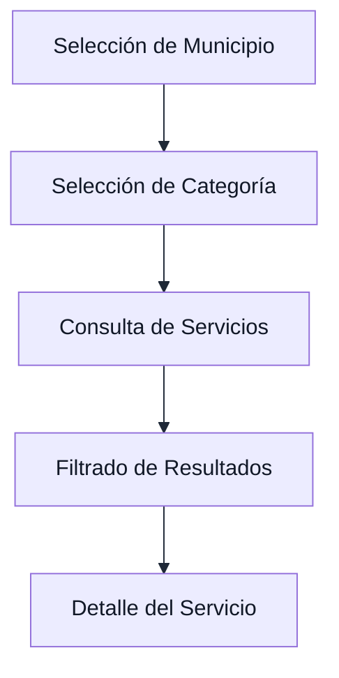
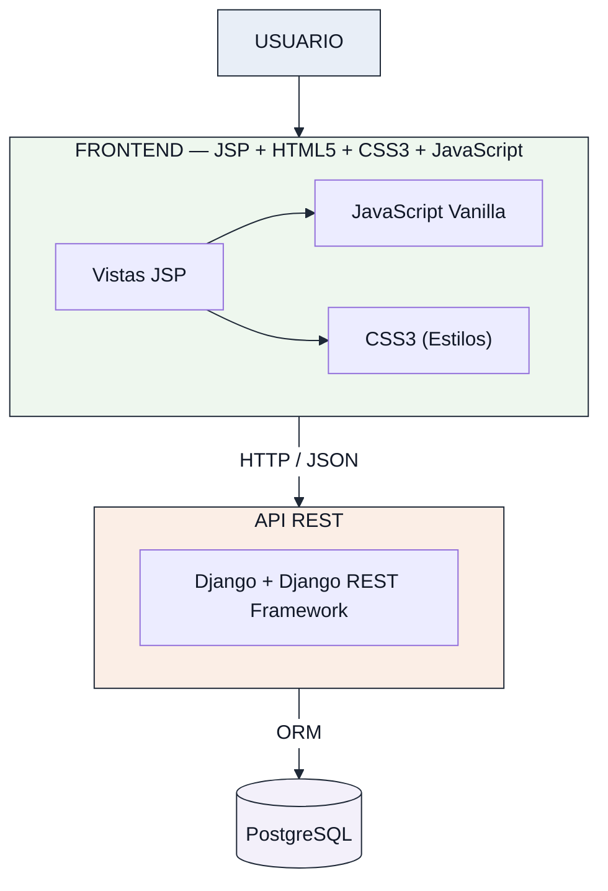
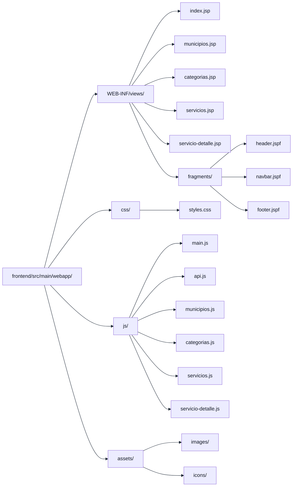
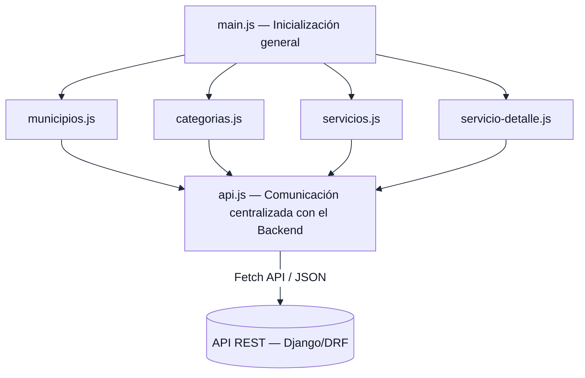
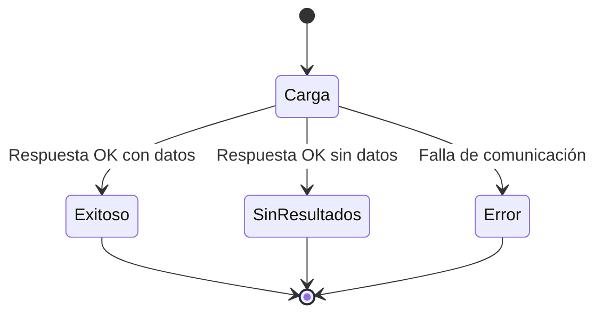
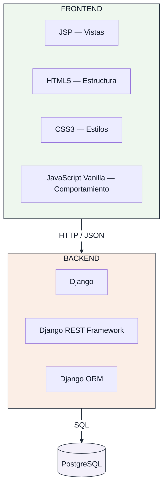
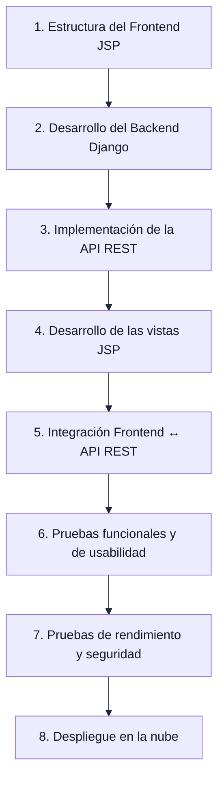

# Estructura del Frontend — RuralConecta-Proyecto

> **Versión 2.0** — Actualización de la arquitectura frontend para utilizar JSP, HTML5, CSS3 y JavaScript Vanilla. Eliminación de Tailwind CSS. Mantenimiento de Django, DRF y PostgreSQL como componentes del backend y persistencia.

---

## 1. Identificación del Documento

| Campo | Detalle |
|---|---|
| **Proyecto** | RuralConecta-Proyecto |
| **Componente** | Frontend |
| **Tipo de aplicación** | Aplicación web Full Stack — MVP |
| **Tecnologías principales** | JSP + HTML5 + CSS3 + JavaScript Vanilla |
| **Arquitectura** | Frontend desacoplado mediante API REST |
| **Ubicación** | `frontend/` |
| **Documento relacionado** | `docs/arquitectura/especificacion-tecnica.md` |
| **Estado** | Fase de arquitectura y planificación |

---

## 2. Propósito

El Frontend de RuralConecta-Proyecto constituye la capa de presentación de la aplicación web y será responsable de proporcionar al usuario una interfaz sencilla, clara, responsiva y accesible para consultar información sobre servicios y trámites disponibles en comunidades rurales de Antioquia.

El Frontend no tendrá acceso directo a la base de datos. La información dinámica será obtenida mediante solicitudes HTTP hacia la API REST desarrollada en el Backend.

La separación entre ambas capas permitirá mantener una arquitectura desacoplada, facilitando el mantenimiento, las pruebas y futuras ampliaciones del sistema.

### Flujo principal de consulta



---

## 3. Objetivos del Frontend

### 3.1. Objetivo General

Diseñar y estructurar una interfaz web responsiva que permita a los usuarios consultar de manera sencilla y organizada información sobre servicios y trámites de comunidades rurales de Antioquia mediante el consumo de una API REST.

### 3.2. Objetivos Específicos

- Proporcionar una interfaz clara y sencilla para usuarios con diferentes niveles de alfabetización digital.
- Permitir la selección de municipios disponibles en la plataforma.
- Permitir la navegación por categorías de servicios.
- Mostrar y filtrar los servicios disponibles.
- Presentar información detallada de cada servicio.
- Mantener una comunicación desacoplada con el Backend mediante HTTP y JSON.
- Garantizar una correcta visualización en dispositivos móviles, tabletas y computadores.
- Mantener una estructura modular que facilite el mantenimiento y crecimiento futuro del proyecto.
- Optimizar la carga de recursos considerando las posibles limitaciones de conectividad de las zonas rurales.

---

## 4. Tecnologías Seleccionadas

| Tecnología | Rol en el Frontend |
|---|---|
| **JSP (JavaServer Pages)** | Tecnología principal para la construcción de vistas dinámicas. Permite presentar información, reutilizar fragmentos (`.jspf`) y separar la presentación de la lógica. |
| **HTML5** | Estructuración semántica de las páginas y contenido (header, nav, main, section, article, footer, form). |
| **CSS3** | Diseño visual, Responsive Design y estilos de la interfaz. Tecnología oficial de estilos. Incluye: Flexbox, Grid, variables CSS, media queries, transiciones. |
| **JavaScript Vanilla** | Lógica de interacción, manipulación del DOM, filtros, validaciones del lado cliente y consumo de la API REST. |
| **Fetch API** | Comunicación HTTP asíncrona con el Backend. |
| **JSON** | Formato de intercambio de información entre Frontend y Backend. |
| **Fragmentos JSPF** | Componentes de presentación reutilizables (header, navbar, footer). Extensión `.jspf`. |
| **Git** | Control de versiones. |
| **GitHub** | Almacenamiento y colaboración sobre el código fuente. |

### 4.1. Justificación tecnológica

Se utilizará JSP, HTML5, CSS3 y JavaScript Vanilla porque estas tecnologías permiten construir un MVP ligero sin introducir la complejidad adicional de frameworks frontend como React, Vue o Angular.

- **JSP** permite generar vistas dinámicas en el servidor, reutilizar fragmentos de presentación y mantener una separación clara entre estructura y lógica.
- **HTML5** proporciona la base semántica de todas las páginas, mejorando accesibilidad y SEO.
- **CSS3** permite implementar una interfaz responsiva y organizada mediante Flexbox, Grid, variables CSS y media queries, sin depender de frameworks externos.
- **JavaScript Vanilla** permite controlar la interacción, manipular el DOM y realizar solicitudes HTTP hacia la API REST sin agregar dependencias innecesarias.

> **Tecnologías eliminadas del Frontend:** Tailwind CSS no forma parte de la arquitectura del Frontend.
> No se utilizarán frameworks frontend (React, Vue, Angular).

---

## 5. Arquitectura del Frontend

El Frontend forma parte de una arquitectura desacoplada en la que la capa de presentación se comunica con el Backend mediante una API REST.



El Frontend únicamente será responsable de la presentación, interacción y consumo de los datos proporcionados por la API.

---

## 6. Estructura de Directorios

La estructura propuesta para el Frontend, adaptada al uso de JSP, es:

```text
frontend/
└── src/
    └── main/
        └── webapp/
            ├── WEB-INF/
            │   └── views/
            │       ├── index.jsp
            │       ├── municipios.jsp
            │       ├── categorias.jsp
            │       ├── servicios.jsp
            │       ├── servicio-detalle.jsp
            │       └── fragments/
            │           ├── header.jspf
            │           ├── navbar.jspf
            │           └── footer.jspf
            │
            ├── css/
            │   └── styles.css
            │
            ├── js/
            │   ├── main.js
            │   ├── api.js
            │   ├── municipios.js
            │   ├── categorias.js
            │   ├── servicios.js
            │   └── servicio-detalle.js
            │
            └── assets/
                ├── images/
                └── icons/
```

> **Nota:** Esta estructura es la propuesta arquitectónica. Si durante la implementación se adopta una organización diferente pero funcionalmente equivalente, la estructura real deberá documentarse en ese momento.

Esta organización separa las responsabilidades del Frontend en:

- **Vistas JSP** (`WEB-INF/views/`) — Páginas de la aplicación y fragmentos reutilizables.
- **Estilos CSS3** (`css/`) — Hoja de estilos principal.
- **Lógica JavaScript** (`js/`) — Módulos de interacción y comunicación con la API.
- **Recursos visuales** (`assets/`) — Imágenes e iconos.



---

## 7. JSP — JavaServer Pages

### 7.1. Responsabilidad de JSP en la arquitectura

JSP es la tecnología principal de presentación del Frontend. Sus responsabilidades son:

- Construcción de las vistas de la aplicación.
- Presentación de información dinámica recibida de la API REST.
- Reutilización de fragmentos de interfaz mediante archivos `.jspf`.
- Integración de datos con la capa de presentación.
- Separación de la estructura de presentación respecto a la lógica de negocio.

### 7.2. Páginas principales (`.jsp`)

| Archivo JSP | Responsabilidad |
|---|---|
| `index.jsp` | Página de inicio: identidad del proyecto, acceso al flujo de consulta. |
| `municipios.jsp` | Presentación del catálogo de municipios disponibles. |
| `categorias.jsp` | Presentación de las categorías temáticas de servicios. |
| `servicios.jsp` | Listado de servicios con soporte de filtros por municipio y categoría. |
| `servicio-detalle.jsp` | Ficha técnica completa de un servicio seleccionado. |

### 7.3. Fragmentos reutilizables (`.jspf`)

Los fragmentos JSP permiten definir una sola vez los elementos comunes de la interfaz y reutilizarlos en todas las páginas, evitando duplicación de código HTML.

| Fragmento | Contenido |
|---|---|
| `header.jspf` | Encabezado general de la aplicación (logo, nombre del proyecto). |
| `navbar.jspf` | Barra de navegación principal con los accesos del flujo de consulta. |
| `footer.jspf` | Pie de página con información institucional. |

### 7.4. Buenas prácticas para JSP

- No colocar lógica de negocio compleja dentro de archivos JSP.
- Utilizar fragmentos `.jspf` para evitar duplicar estructuras HTML.
- Validar los parámetros recibidos antes de utilizarlos en las vistas.
- No exponer información sensible en los fragmentos de presentación.
- Evitar insertar contenido no confiable directamente en el HTML de la vista.
- Mantener separación estricta entre presentación (JSP) y comportamiento (JavaScript).

---

## 8. HTML5

### 8.1. Responsabilidad

HTML5 es la base estructural de todas las vistas JSP. Define la semántica y jerarquía del contenido de cada página.

### 8.2. Elementos semánticos a utilizar

Se priorizará el uso de etiquetas semánticas de HTML5 para mejorar accesibilidad y estructura:

| Elemento | Uso previsto |
|---|---|
| `<header>` | Encabezado principal de la aplicación. |
| `<nav>` | Barra de navegación y menús. |
| `<main>` | Contenido principal de cada vista. |
| `<section>` | Secciones temáticas del contenido. |
| `<article>` | Tarjetas de servicios individuales. |
| `<footer>` | Pie de página. |
| `<form>` | Formularios de filtrado. |
| `<label>` | Etiquetas descriptivas para controles de formulario. |
| `<button>` | Acciones interactivas. |

### 8.3. Principios

- Una sola etiqueta `<h1>` por página.
- Jerarquía de encabezados coherente (`h1` → `h2` → `h3`).
- Uso de atributos `alt` en todas las imágenes.
- Estructura semántica que facilite la accesibilidad y la lectura por tecnologías asistivas.

---

## 9. CSS3

### 9.1. Responsabilidad

CSS3 es la tecnología oficial de estilos del Frontend. Reemplaza completamente a Tailwind CSS.

La hoja de estilos principal será:

```text
frontend/.../webapp/css/styles.css
```

Si el proyecto crece en complejidad, podrá dividirse por responsabilidades (base, layout, componentes, utilities), pero en el MVP se mantendrá un archivo principal.

### 9.2. Técnicas y herramientas CSS3 a utilizar

| Técnica | Propósito |
|---|---|
| **Variables CSS** (`--var`) | Definición centralizada de colores, tipografía, espaciados. |
| **Flexbox** | Distribución de elementos en una dimensión (filas o columnas). |
| **CSS Grid** | Distribución de layouts en dos dimensiones. |
| **Media queries** | Adaptación del diseño a diferentes tamaños de pantalla. |
| **Pseudoclases** | Estados de elementos: `:hover`, `:focus`, `:active`. |
| **Transiciones ligeras** | Mejoras de experiencia visual cuando sean necesarias. |
| **Unidades relativas** | `rem`, `em`, `%`, `vw`, `vh` para diseño flexible. |

### 9.3. Principios de organización

- Evitar CSS duplicado.
- Evitar estilos inline innecesarios.
- Evitar especificidad excesiva.
- Mantener nombres de clases descriptivos.
- Organizar el archivo con comentarios por secciones.
- Priorizar reutilización de estilos.

### 9.4. Estructura sugerida para styles.css

```css
/* ===========================
   VARIABLES Y DISEÑO BASE
   =========================== */

/* ===========================
   TIPOGRAFÍA
   =========================== */

/* ===========================
   LAYOUT Y GRID
   =========================== */

/* ===========================
   COMPONENTES
   =========================== */

/* ===========================
   ESTADOS DE INTERFAZ
   =========================== */

/* ===========================
   RESPONSIVE DESIGN
   =========================== */
```

---

## 10. JavaScript Vanilla

### 10.1. Responsabilidad

JavaScript Vanilla es el lenguaje de comportamiento del Frontend. Se mantendrá sin frameworks adicionales.

Sus responsabilidades serán:

- Interacción del usuario (eventos).
- Manipulación del DOM.
- Filtros y validaciones del lado cliente.
- Estados de interfaz (carga, éxito, error, sin resultados).
- Solicitudes HTTP hacia la API REST mediante Fetch API.
- Actualización dinámica del contenido sin recargar la página.

### 10.2. Organización de módulos JavaScript



### 10.3. Descripción de módulos

| Módulo | Responsabilidad |
|---|---|
| `main.js` | Inicialización general, configuración global, eventos compartidos. |
| `api.js` | Centraliza todas las solicitudes HTTP hacia el Backend. Evita que cada módulo implemente sus propias peticiones. |
| `municipios.js` | Carga y presentación de municipios, selección, manejo de estados. |
| `categorias.js` | Carga y presentación de categorías, selección, manejo de estados. |
| `servicios.js` | Consulta de servicios, filtrado por municipio/categoría, presentación de resultados. |
| `servicio-detalle.js` | Identificación del servicio seleccionado, solicitud a la API, renderización del detalle. |

---

## 11. Componentes Reutilizables

Los fragmentos JSPF y los módulos JavaScript permiten organizar elementos de interfaz que se utilizarán en diferentes páginas.

### 11.1. Fragmentos JSP reutilizables

```text
fragments/
├── header.jspf   — Encabezado general de la aplicación
├── navbar.jspf   — Barra de navegación principal
└── footer.jspf   — Pie de página con información institucional
```

La inclusión de fragmentos en las vistas se realizará mediante la directiva JSP estándar:

```jsp
<%@ include file="fragments/header.jspf" %>
<%@ include file="fragments/navbar.jspf" %>

<!-- contenido principal -->

<%@ include file="fragments/footer.jspf" %>
```

### 11.2. Recursos visuales

```text
assets/
├── images/   — Imágenes utilizadas por la aplicación
└── icons/    — Iconos de categorías, navegación y acciones
```

Los recursos deberán mantenerse optimizados para reducir el peso de transferencia.

---

## 12. Flujo de Navegación

El flujo principal del usuario se define de la siguiente manera:


Este flujo corresponde a los requisitos funcionales definidos para el MVP.

---

## 13. Comunicación con la API REST

La comunicación entre el Frontend y el Backend se realizará mediante el protocolo HTTP/HTTPS.

Los datos serán intercambiados en formato JSON.

### Recursos principales

| Método | Endpoint | Propósito |
|---|---|---|
| GET | `/api/v1/municipios/` | Obtener municipios. |
| GET | `/api/v1/municipios/{id}/` | Obtener un municipio. |
| GET | `/api/v1/categorias/` | Obtener categorías. |
| GET | `/api/v1/categorias/{id}/` | Obtener una categoría. |
| GET | `/api/v1/servicios/` | Obtener servicios. |
| GET | `/api/v1/servicios/{id}/` | Obtener detalle de un servicio. |

Los filtros se realizarán mediante parámetros de consulta:

```
/api/v1/servicios/?municipio={id}
/api/v1/servicios/?categoria={id}
/api/v1/servicios/?municipio={id}&categoria={id}
```

El Frontend no realizará consultas SQL ni establecerá conexiones directas con PostgreSQL.

---

## 14. Estados de Interfaz

La interfaz deberá contemplar diferentes estados durante el consumo de información.



| Estado | Descripción | Responsable |
|---|---|---|
| **Carga** | Indicación visual mientras se obtiene información de la API. | JavaScript + CSS3 |
| **Exitoso** | Los datos se presentan de manera estructurada en la vista. | JSP + JavaScript |
| **Sin resultados** | Mensaje claro indicando que no existen resultados para los filtros seleccionados. | JavaScript |
| **Error** | Mensaje comprensible para el usuario sin exponer información técnica sensible. | JavaScript |

---

## 15. Responsive Design

El Frontend se desarrollará con un enfoque Responsive Design implementado mediante CSS3.

| Dispositivo | Resolución |
|---|---|
| Móvil | 360 px – 767 px |
| Tablet | 768 px – 1023 px |
| Escritorio | ≥ 1024 px |

### Implementación con CSS3

```css
/* Móvil — base (mobile-first) */
.contenedor { ... }

/* Tablet */
@media (min-width: 768px) {
    .contenedor { ... }
}

/* Escritorio */
@media (min-width: 1024px) {
    .contenedor { ... }
}
```

Se utilizarán:

- Flexbox para distribución flexible de elementos.
- CSS Grid para layouts de dos dimensiones.
- Media queries para breakpoints.
- Unidades relativas (`rem`, `%`, `vw`, `vh`).
- Variables CSS para mantener consistencia visual.

> **Nota:** No se utilizarán clases responsive de Tailwind. El diseño responsive se implementará íntegramente mediante CSS3.

---

## 16. Accesibilidad

La interfaz seguirá buenas prácticas básicas de accesibilidad:

- Uso de HTML semántico.
- Etiquetas descriptivas para controles (`<label>`, `aria-label`).
- Contraste suficiente entre texto y fondo.
- Tamaño adecuado de elementos interactivos (áreas táctiles mínimas).
- Textos comprensibles y mensajes de error claros.
- Uso adecuado de atributos `alt` en imágenes.
- Navegación coherente y predecible.

**Criterio visual obligatorio:** Los textos incluidos en diagramas y gráficas deberán utilizar negro o un tono suficientemente oscuro. No se utilizará texto gris claro sobre fondos claros.

---

## 17. Seguridad en el Frontend

- No almacenar credenciales sensibles en archivos públicos.
- No incluir secretos o claves privadas dentro del código JavaScript.
- Validar los datos recibidos antes de utilizarlos en la interfaz.
- Evitar la inserción directa de contenido no confiable mediante `innerHTML`.
- Preferir `textContent` para renderizar texto dinámico proveniente de la API.
- Mantener la comunicación mediante HTTPS en producción.
- Respetar las políticas CORS configuradas en el Backend.
- No realizar conexiones directas con la base de datos.
- No exponer información sensible en mensajes de error.
- En JSP: no colocar lógica de negocio compleja directamente en las vistas; validar parámetros recibidos.

---

## 18. Rendimiento

Debido al contexto de comunidades rurales y posibles limitaciones de conectividad, el Frontend priorizará un bajo consumo de recursos:

- CSS3 ligero y bien organizado, sin dependencias externas.
- JavaScript Vanilla sin frameworks pesados.
- JSP con estructuras simples y bien definidas.
- Imágenes optimizadas.
- Pocas dependencias.
- Solicitudes HTTP estrictamente necesarias.
- Respuestas JSON compactas desde el Backend.
- Cargar únicamente los recursos necesarios por página.

**Meta de rendimiento definida:**

> **Tiempo de respuesta de la API ≤ 2 segundos** en condiciones normales de conectividad.

---

## 19. Buenas Prácticas de Desarrollo

### 19.1. Separación de responsabilidades

| Capa | Tecnología | Responsabilidad |
|---|---|---|
| Presentación | JSP + HTML5 | Estructura y visualización de vistas |
| Estilos | CSS3 | Apariencia visual y diseño responsive |
| Comportamiento | JavaScript Vanilla | Interacción, DOM, consumo de API |
| Lógica de negocio | Django + DRF | Validación, procesamiento, API REST |
| Persistencia | PostgreSQL | Almacenamiento de datos |

### 19.2. Reutilización

Se evitará duplicar código y elementos de interfaz cuando puedan ser reutilizados (fragmentos JSPF, módulos JS).

### 19.3. Código legible

Se utilizarán nombres descriptivos para archivos, variables, funciones, clases CSS y elementos JSP.

### 19.4. Modularidad

La lógica JavaScript se mantendrá separada según la responsabilidad de cada módulo.

### 19.5. Dependencias mínimas

No se incorporarán frameworks o librerías adicionales sin una justificación técnica.

### 19.6. Control de versiones

Cada cambio significativo se registrará mediante commits semánticos descriptivos.

```
feat: create JSP frontend structure
feat: add service listing view
fix: correct service filtering
docs: update frontend architecture
style: improve responsive CSS3 layout
```

### 19.7. No duplicación de lógica

Las funciones utilizadas por diferentes páginas se centralizarán en `api.js` o `main.js` cuando sea apropiado.

---

## 20. Integración con el Backend

El Frontend y Backend mantendrán responsabilidades independientes:



Esta separación permitirá desarrollar y probar cada componente de forma independiente.

---

## 21. Relación con los Requisitos Funcionales

| Requisito | Componente Frontend relacionado |
|---|---|
| RF-01 — Consultar municipios | `municipios.jsp` + `municipios.js` |
| RF-02 — Consultar categorías | `categorias.jsp` + `categorias.js` |
| RF-03 — Consultar servicios | `servicios.jsp` + `servicios.js` |
| RF-04 — Filtrar por municipio | `servicios.jsp` + `servicios.js` (filtros en `styles.css`) |
| RF-05 — Filtrar por categoría | `servicios.jsp` + `servicios.js` (filtros en `styles.css`) |
| RF-06 — Visualizar detalle | `servicio-detalle.jsp` + `servicio-detalle.js` |
| RF-07 — Consumo JSON | `api.js` (centraliza peticiones HTTP) |

---

## 22. Alcance de la Estructura del Frontend

### Incluido

- Estructura de directorios JSP propuesta.
- Definición de vistas JSP.
- Definición de fragmentos JSPF reutilizables.
- Definición de módulos JavaScript.
- Organización de estilos CSS3.
- Organización de recursos visuales.
- Flujo de navegación.
- Definición de comunicación con la API.
- Consideraciones Responsive Design con CSS3.
- Buenas prácticas.
- Consideraciones básicas de seguridad y rendimiento.

### No incluido todavía

- Implementación completa de la interfaz.
- Conexión funcional con la API.
- Implementación definitiva de filtros.
- Datos reales.
- Autenticación.
- Panel administrativo.
- Geolocalización.
- Aplicación móvil nativa.

---

## 23. Estado del Documento

| Elemento | Estado |
|---|---|
| Definición de tecnologías | Completado |
| Definición de arquitectura | Completado |
| Organización de directorios JSP | Definido |
| Definición de vistas JSP | Definido |
| Definición de fragmentos JSPF | Definido |
| Definición de módulos JavaScript | Definido |
| Flujo de navegación | Definido |
| Integración conceptual con API | Definido |
| Diseño visual definitivo | Pendiente |
| Implementación funcional | Pendiente |
| Integración Frontend-Backend | Pendiente |
| Pruebas | Pendiente |
| Despliegue | Pendiente |

---

## 24. Próxima Etapa

Una vez aprobada y registrada la estructura del Frontend, el desarrollo continuará con la implementación progresiva de los componentes definidos.



La estructura podrá ajustarse durante el desarrollo cuando exista una justificación técnica, manteniendo como principios principales la simplicidad, modularidad, mantenibilidad, seguridad y adecuación al alcance del MVP.

---

## 25. Control de Cambios

| Versión | Fecha | Descripción | Responsable |
|---|---|---|---|
| 1.0 | 2026-08-18 | Creación de la estructura técnica inicial del Frontend con HTML5 + Tailwind CSS + JavaScript Vanilla. | Equipo RuralConecta |
| 2.0 | 2026-08-19 | Actualización de la arquitectura frontend para utilizar JSP, HTML5, CSS3 y JavaScript Vanilla. Eliminación de Tailwind CSS. Incorporación de fragmentos JSPF. Actualización de estructura de directorios, diagramas, secciones de tecnologías, estilos, responsive y buenas prácticas. | Equipo RuralConecta |