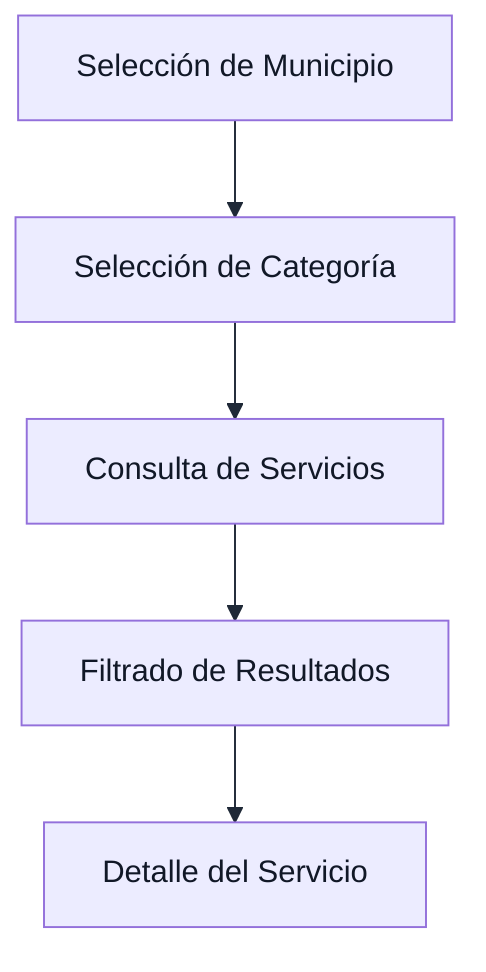
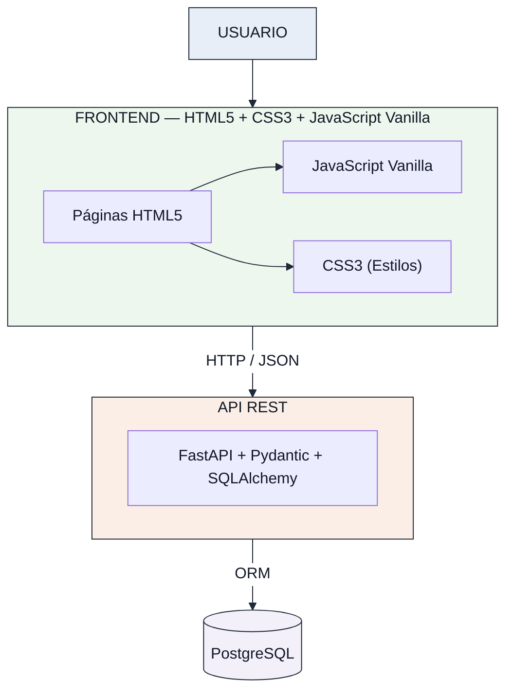
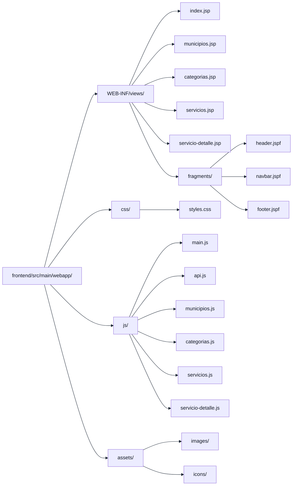
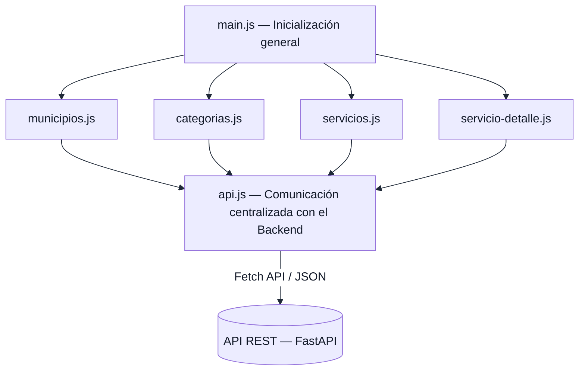
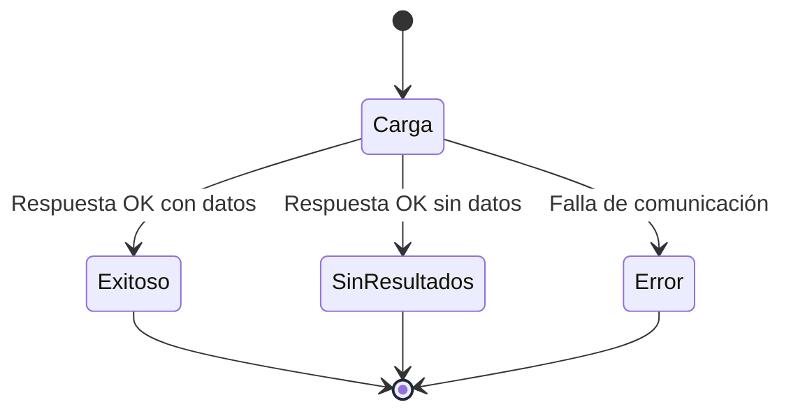
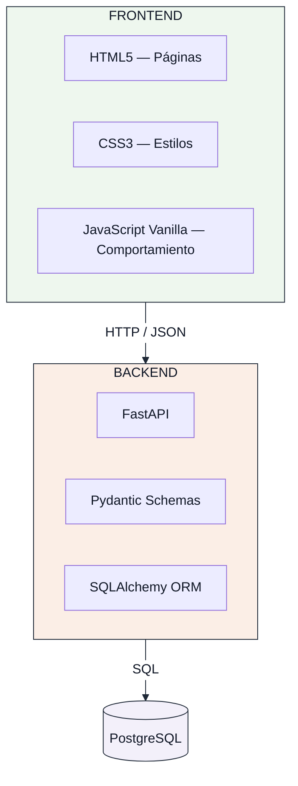
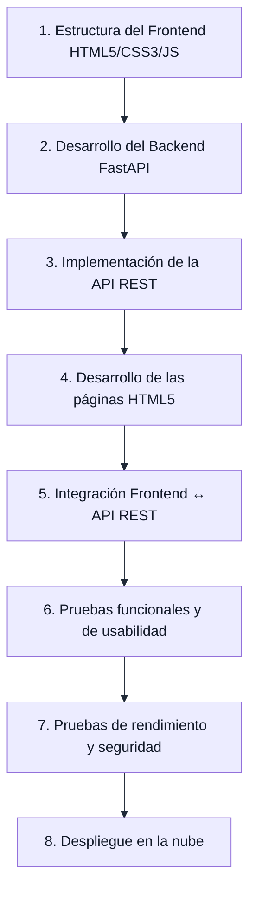

# Estructura del Frontend — RuralConecta-Proyecto

> **Versión 4.0** — Actualización de la arquitectura frontend para utilizar HTML5 semántico, CSS3 y JavaScript Vanilla desacoplado. Eliminación de JavaServer Pages (JSP) y dependencias de servidores Java. Integración directa con la API REST desarrollada en FastAPI.

---

## 1. Identificación del Documento

| Campo | Detalle |
|---|---|
| **Proyecto** | RuralConecta-Proyecto |
| **Componente** | Frontend |
| **Tipo de aplicación** | Aplicación web Full Stack — MVP |
| **Tecnologías principales** | HTML5 + CSS3 + JavaScript Vanilla |
| **Arquitectura** | Frontend desacoplado mediante API REST |
| **Ubicación** | `frontend/` |
| **Documento relacionado** | `docs/arquitectura/especificacion-tecnica.md` |
| **Estado** | Fase de arquitectura y planificación |

---

## 2. Propósito

El Frontend de RuralConecta-Proyecto constituye la capa de presentación de la aplicación web y será responsable de proporcionar al usuario una interfaz sencilla, clara, responsiva y accesible para consultar información sobre servicios y trámites disponibles en comunidades rurales de Antioquia.

El Frontend no tendrá acceso directo a la base de datos. La información dinámica será obtenida mediante solicitudes HTTP hacia la API REST desarrollada en el Backend.

La separación entre ambas capas permitirá mantener una arquitectura desacoplada, facilitando el mantenimiento, las pruebas y futuras ampliaciones del sistema.

### Flujo principal de consulta



---

## 3. Objetivos del Frontend

### 3.1. Objetivo General

Diseñar y estructurar una interfaz web responsiva que permita a los usuarios consultar de manera sencilla y organizada información sobre servicios y trámites de comunidades rurales de Antioquia mediante el consumo de una API REST.

### 3.2. Objetivos Específicos

- Proporcionar una interfaz clara y sencilla para usuarios con diferentes niveles de alfabetización digital.
- Permitir la selección de municipios disponibles en la plataforma.
- Permitir la navegación por categorías de servicios.
- Mostrar y filtrar los servicios disponibles.
- Presentar información detallada de cada servicio.
- Mantener una comunicación desacoplada con el Backend mediante HTTP y JSON.
- Garantizar una correcta visualización en dispositivos móviles, tabletas y computadores.
- Mantener una estructura modular que facilite el mantenimiento y crecimiento futuro del proyecto.
- Optimizar la carga de recursos considerando las posibles limitaciones de conectividad de las zonas rurales.

---

## 4. Tecnologías Seleccionadas

| Tecnología | Rol en el Frontend |
|---|---|
| **HTML5** | Estructuración semántica de las páginas y vistas del cliente web (header, nav, main, section, article, footer, form). |
| **CSS3** | Diseño visual, Responsive Design y estilos de la interfaz (Flexbox, Grid, variables CSS, media queries, transiciones). |
| **JavaScript Vanilla** | Lógica de interacción, manipulación del DOM, filtros, validaciones del lado cliente y consumo asíncrono de la API REST. |
| **Fetch API** | Comunicación HTTP asíncrona nativa con el Backend. |
| **JSON** | Formato de intercambio de información entre Frontend y Backend. |
| **Git** | Control de versiones. |
| **GitHub** | Almacenamiento y colaboración sobre el código fuente. |

### 4.1. Justificación tecnológica

Se utilizará HTML5, CSS3 y JavaScript Vanilla porque estas tecnologías permiten construir un cliente web desacoplado, ligero y de alto rendimiento sin requerir frameworks frontend complejos (React, Vue, Angular) ni dependencias de servidores de aplicaciones Java (Tomcat / JSP).

- **HTML5** proporciona la base semántica de todas las páginas de consulta, garantizando accesibilidad y legibilidad.
- **CSS3** permite implementar una interfaz responsiva y organizada mediante Flexbox, Grid, variables CSS y media queries.
- **JavaScript Vanilla** permite controlar la interacción, manipular el DOM y realizar solicitudes HTTP asíncronas hacia la API REST en FastAPI sin dependencias externas.

> **Tecnologías eliminadas del Frontend:** JavaServer Pages (JSP), fragmentos JSPF, Tailwind CSS y frameworks JS pesados no forman parte de la arquitectura del Frontend.

---

## 5. Arquitectura del Frontend

El Frontend forma parte de una arquitectura desacoplada en la que la capa de presentación se comunica con el Backend mediante una API REST.



El Frontend únicamente será responsable de la presentación, interacción y consumo de los datos proporcionados por la API.

---

## 6. Estructura de Directorios

La estructura propuesta para el Frontend es:

```text
frontend/
├── index.html                  # Página de inicio e identidad del proyecto
├── municipios.html             # Catálogo de municipios disponibles
├── categorias.html             # Catálogo de categorías temáticas
├── servicios.html              # Listado de servicios y filtros dinámicos
├── servicio-detalle.html       # Ficha técnica detallada del servicio
│
├── css/
│   └── styles.css              # Hoja de estilos principal (Flexbox, Grid, variables, media queries)
│
├── js/
│   ├── main.js                 # Inicialización general y eventos globales
│   ├── api.js                  # Cliente Fetch API centralizado (comunicación con FastAPI)
│   ├── municipios.js           # Lógica y renderizado del catálogo de municipios
│   ├── categorias.js           # Lógica y renderizado de categorías
│   ├── servicios.js            # Consulta y filtrado dinámico de servicios
│   └── servicio-detalle.js     # Renderización de la ficha técnica detallada
│
└── assets/
    ├── images/                 # Imágenes estáticas e ilustraciones
    └── icons/                  # Iconos SVG de navegación y categorías
```

Esta organización separa las responsabilidades del Frontend en:

- **Páginas HTML5** (`*.html`) — Estructura semántica de cada vista del cliente web.
- **Estilos CSS3** (`css/styles.css`) — Hoja de estilos única y centralizada.
- **Lógica JavaScript** (`js/`) — Módulos de interacción y consumo asíncrono de la API REST.
- **Recursos visuales** (`assets/`) — Imágenes e iconos.



---

## 7. Estructura de Vistas HTML5 Semánticas

### 7.1. Responsabilidad de HTML5 en la arquitectura

HTML5 constituye la base estructural directa del Frontend. Sus responsabilidades son:

- Proporcionar la estructura semántica de la interfaz del usuario.
- Servir como contenedor declarativo sobre el cual JavaScript renderiza los datos dinámicos provenientes de la API REST.
- Garantizar accesibilidad y optimización de carga en el navegador.

### 7.2. Páginas Principales (`.html`)

| Archivo HTML | Responsabilidad |
|---|---|
| `index.html` | Página de inicio: presentación institucional y acceso directo al flujo de consulta. |
| `municipios.html` | Presentación del catálogo de municipios rurales de Antioquia. |
| `categorias.html` | Presentación de las categorías temáticas (Salud, Educación, Transporte, etc.). |
| `servicios.html` | Listado dinámico de servicios con barra de filtrado por municipio y categoría. |
| `servicio-detalle.html` | Ficha técnica detallada con ubicación, horarios, requisitos y contactos. |

---

## 8. HTML5

### 8.1. Responsabilidad

HTML5 es la base estructural del cliente web. Define la semántica y la jerarquía de contenidos en cada página.

### 8.2. Elementos semánticos a utilizar

Se priorizará el uso de etiquetas semánticas de HTML5 para mejorar accesibilidad y estructura:

| Elemento | Uso previsto |
|---|---|
| `<header>` | Encabezado principal de la aplicación. |
| `<nav>` | Barra de navegación y menús. |
| `<main>` | Contenido principal de cada vista. |
| `<section>` | Secciones temáticas del contenido. |
| `<article>` | Tarjetas de servicios individuales. |
| `<footer>` | Pie de página. |
| `<form>` | Formularios de filtrado. |
| `<label>` | Etiquetas descriptivas para controles de formulario. |
| `<button>` | Acciones interactivas. |

### 8.3. Principios

- Una sola etiqueta `<h1>` por página.
- Jerarquía de encabezados coherente (`h1` → `h2` → `h3`).
- Uso de atributos `alt` en todas las imágenes.
- Estructura semántica que facilite la accesibilidad y la lectura por tecnologías asistivas.

---

## 9. CSS3

### 9.1. Responsabilidad

CSS3 es la tecnología oficial de estilos del Frontend. Reemplaza completamente a Tailwind CSS.

La hoja de estilos principal será:

```text
frontend/.../webapp/css/styles.css
```

Si el proyecto crece en complejidad, podrá dividirse por responsabilidades (base, layout, componentes, utilities), pero en el MVP se mantendrá un archivo principal.

### 9.2. Técnicas y herramientas CSS3 a utilizar

| Técnica | Propósito |
|---|---|
| **Variables CSS** (`--var`) | Definición centralizada de colores, tipografía, espaciados. |
| **Flexbox** | Distribución de elementos en una dimensión (filas o columnas). |
| **CSS Grid** | Distribución de layouts en dos dimensiones. |
| **Media queries** | Adaptación del diseño a diferentes tamaños de pantalla. |
| **Pseudoclases** | Estados de elementos: `:hover`, `:focus`, `:active`. |
| **Transiciones ligeras** | Mejoras de experiencia visual cuando sean necesarias. |
| **Unidades relativas** | `rem`, `em`, `%`, `vw`, `vh` para diseño flexible. |

### 9.3. Principios de organización

- Evitar CSS duplicado.
- Evitar estilos inline innecesarios.
- Evitar especificidad excesiva.
- Mantener nombres de clases descriptivos.
- Organizar el archivo con comentarios por secciones.
- Priorizar reutilización de estilos.

### 9.4. Estructura sugerida para styles.css

```css
/* ===========================
   VARIABLES Y DISEÑO BASE
   =========================== */

/* ===========================
   TIPOGRAFÍA
   =========================== */

/* ===========================
   LAYOUT Y GRID
   =========================== */

/* ===========================
   COMPONENTES
   =========================== */

/* ===========================
   ESTADOS DE INTERFAZ
   =========================== */

/* ===========================
   RESPONSIVE DESIGN
   =========================== */
```

---

## 10. JavaScript Vanilla

### 10.1. Responsabilidad

JavaScript Vanilla es el lenguaje de comportamiento del Frontend. Se mantendrá sin frameworks adicionales.

Sus responsabilidades serán:

- Interacción del usuario (eventos).
- Manipulación del DOM.
- Filtros y validaciones del lado cliente.
- Estados de interfaz (carga, éxito, error, sin resultados).
- Solicitudes HTTP hacia la API REST mediante Fetch API.
- Actualización dinámica del contenido sin recargar la página.

### 10.2. Organización de módulos JavaScript



### 10.3. Descripción de módulos

| Módulo | Responsabilidad |
|---|---|
| `main.js` | Inicialización general, configuración global, eventos compartidos. |
| `api.js` | Centraliza todas las solicitudes HTTP hacia el Backend. Evita que cada módulo implemente sus propias peticiones. |
| `municipios.js` | Carga y presentación de municipios, selección, manejo de estados. |
| `categorias.js` | Carga y presentación de categorías, selección, manejo de estados. |
| `servicios.js` | Consulta de servicios, filtrado por municipio/categoría, presentación de resultados. |
| `servicio-detalle.js` | Identificación del servicio seleccionado, solicitud a la API, renderización del detalle. |

---

## 11. Componentes Reutilizables

Los módulos JavaScript y las clases CSS3 estructuradas permiten organizar elementos de interfaz que se utilizarán en diferentes páginas.

### 11.1. Recursos visuales y módulos

```text
assets/
├── images/   — Imágenes estáticas e ilustraciones
└── icons/    — Iconos de categorías, navegación y acciones
```

Los recursos deberán mantenerse optimizados para reducir el peso de transferencia.

### 11.2. Recursos visuales

```text
assets/
├── images/   — Imágenes utilizadas por la aplicación
└── icons/    — Iconos de categorías, navegación y acciones
```

Los recursos deberán mantenerse optimizados para reducir el peso de transferencia.

---

## 12. Flujo de Navegación

El flujo principal del usuario se define de la siguiente manera:


Este flujo corresponde a los requisitos funcionales definidos para el MVP.

---

## 13. Comunicación con la API REST

La comunicación entre el Frontend y el Backend se realizará mediante el protocolo HTTP/HTTPS.

Los datos serán intercambiados en formato JSON.

### Recursos principales

| Método | Endpoint | Propósito |
|---|---|---|
| GET | `/api/v1/municipios/` | Obtener municipios. |
| GET | `/api/v1/municipios/{id}/` | Obtener un municipio. |
| GET | `/api/v1/categorias/` | Obtener categorías. |
| GET | `/api/v1/categorias/{id}/` | Obtener una categoría. |
| GET | `/api/v1/servicios/` | Obtener servicios. |
| GET | `/api/v1/servicios/{id}/` | Obtener detalle de un servicio. |

Los filtros se realizarán mediante parámetros de consulta:

```
/api/v1/servicios/?municipio={id}
/api/v1/servicios/?categoria={id}
/api/v1/servicios/?municipio={id}&categoria={id}
```

El Frontend no realizará consultas SQL ni establecerá conexiones directas con PostgreSQL.

---

## 14. Estados de Interfaz

La interfaz deberá contemplar diferentes estados durante el consumo de información.



| Estado | Descripción | Responsable |
|---|---|---|
| **Carga** | Indicación visual mientras se obtiene información de la API. | JavaScript + CSS3 |
| **Exitoso** | Los datos se presentan de manera estructurada en la vista HTML5. | HTML5 + JavaScript |
| **Sin resultados** | Mensaje claro indicando que no existen resultados para los filtros seleccionados. | JavaScript |
| **Error** | Mensaje comprensible para el usuario sin exponer información técnica sensible. | JavaScript |

---

## 15. Responsive Design

El Frontend se desarrollará con un enfoque Responsive Design implementado mediante CSS3.

| Dispositivo | Resolución |
|---|---|
| Móvil | 360 px – 767 px |
| Tablet | 768 px – 1023 px |
| Escritorio | ≥ 1024 px |

### Implementación con CSS3

```css
/* Móvil — base (mobile-first) */
.contenedor { ... }

/* Tablet */
@media (min-width: 768px) {
    .contenedor { ... }
}

/* Escritorio */
@media (min-width: 1024px) {
    .contenedor { ... }
}
```

Se utilizarán:

- Flexbox para distribución flexible de elementos.
- CSS Grid para layouts de dos dimensiones.
- Media queries para breakpoints.
- Unidades relativas (`rem`, `%`, `vw`, `vh`).
- Variables CSS para mantener consistencia visual.

> **Nota:** No se utilizarán clases responsive de Tailwind. El diseño responsive se implementará íntegramente mediante CSS3.

---

## 16. Accesibilidad

La interfaz seguirá buenas prácticas básicas de accesibilidad:

- Uso de HTML semántico.
- Etiquetas descriptivas para controles (`<label>`, `aria-label`).
- Contraste suficiente entre texto y fondo.
- Tamaño adecuado de elementos interactivos (áreas táctiles mínimas).
- Textos comprensibles y mensajes de error claros.
- Uso adecuado de atributos `alt` en imágenes.
- Navegación coherente y predecible.

**Criterio visual obligatorio:** Los textos incluidos en diagramas y gráficas deberán utilizar negro o un tono suficientemente oscuro. No se utilizará texto gris claro sobre fondos claros.

---

## 17. Seguridad en el Frontend

- No almacenar credenciales sensibles en archivos públicos.
- No incluir secretos o claves privadas dentro del código JavaScript.
- Validar los datos recibidos antes de utilizarlos en la interfaz.
- Evitar la inserción directa de contenido no confiable mediante `innerHTML`.
- Preferir `textContent` para renderizar texto dinámico proveniente de la API.
- Mantener la comunicación mediante HTTPS en producción.
- Respetar las políticas CORS configuradas en el Backend.
- No realizar conexiones directas con la base de datos.
- En el frontend: no colocar lógica de negocio en la capa de presentación; validar parámetros de consulta en el cliente.

---

## 18. Rendimiento

Debido al contexto de comunidades rurales y posibles limitaciones de conectividad, el Frontend priorizará un bajo consumo de recursos:

- CSS3 ligero y bien organizado, sin dependencias externas.
- JavaScript Vanilla sin frameworks pesados.
- Estructura HTML5 limpia y semántica.
- Imágenes e iconos optimizados.
- Pocas dependencias.
- Solicitudes HTTP estrictamente necesarias.
- Respuestas JSON compactas desde el Backend.
- Cargar únicamente los recursos necesarios por página.

**Meta de rendimiento definida:**

> **Tiempo de respuesta de la API ≤ 2 segundos** en condiciones normales de conectividad.

---

## 19. Buenas Prácticas de Desarrollo

### 19.1. Separación de responsabilidades

| Capa | Tecnología | Responsabilidad |
|---|---|---|
| Presentación | HTML5 | Estructura y visualización de vistas semánticas |
| Estilos | CSS3 | Apariencia visual y diseño responsive |
| Comportamiento | JavaScript Vanilla | Interacción, DOM, consumo de API |
| Lógica de negocio | FastAPI + SQLAlchemy | Validación, procesamiento, API REST |
| Persistencia | PostgreSQL | Almacenamiento de datos |

### 19.2. Reutilización

Se evitará duplicar código y elementos de interfaz cuando puedan ser reutilizados (módulos JS, clases CSS3).

### 19.3. Código legible

Se utilizarán nombres descriptivos para archivos, variables, funciones, clases CSS y estructuras HTML.

### 19.4. Modularidad

La lógica JavaScript se mantendrá separada según la responsabilidad de cada módulo.

### 19.5. Dependencias mínimas

No se incorporarán frameworks o librerías adicionales sin una justificación técnica.

### 19.6. Control de versiones

Cada cambio significativo se registrará mediante commits semánticos descriptivos.

```
feat: create HTML5 frontend structure
feat: add service listing view
fix: correct service filtering
docs: update frontend architecture
style: improve responsive CSS3 layout
```

### 19.7. No duplicación de lógica

Las funciones utilizadas por diferentes páginas se centralizarán en `api.js` o `main.js` cuando sea apropiado.

---

## 20. Integración con el Backend

El Frontend y Backend mantendrán responsabilidades independientes:



Esta separación permitirá desarrollar y probar cada componente de forma independiente.

---

## 21. Relación con los Requisitos Funcionales

| Requisito | Componente Frontend relacionado |
|---|---|
| RF-01 — Consultar municipios | `municipios.html` + `municipios.js` |
| RF-02 — Consultar categorías | `categorias.html` + `categorias.js` |
| RF-03 — Consultar servicios | `servicios.html` + `servicios.js` |
| RF-04 — Filtrar por municipio | `servicios.html` + `servicios.js` (filtros en `styles.css`) |
| RF-05 — Filtrar por categoría | `servicios.html` + `servicios.js` (filtros en `styles.css`) |
| RF-06 — Visualizar detalle | `servicio-detalle.html` + `servicio-detalle.js` |
| RF-07 — Consumo JSON | `api.js` (centraliza peticiones HTTP) |

---

## 22. Alcance de la Estructura del Frontend

### Incluido

- Estructura de directorios HTML5/CSS3/JS propuesta.
- Definición de páginas HTML5.
- Definición de módulos JavaScript.
- Organización de estilos CSS3.
- Organización de recursos visuales.
- Flujo de navegación.
- Definición de comunicación con la API.
- Consideraciones Responsive Design con CSS3.
- Buenas prácticas.
- Consideraciones básicas de seguridad y rendimiento.

### No incluido todavía

- Implementación completa de la interfaz.
- Conexión funcional con la API.
- Implementación definitiva de filtros.
- Datos reales.
- Autenticación.
- Panel administrativo.
- Geolocalización.
- Aplicación móvil nativa.

---

## 23. Estado del Documento

| Elemento | Estado |
|---|---|
| Definición de tecnologías | Completado |
| Definición de arquitectura | Completado |
| Organización de directorios HTML5/CSS3/JS | Definido |
| Definición de páginas HTML5 | Definido |
| Definición de módulos JavaScript | Definido |
| Flujo de navegación | Definido |
| Integración conceptual con API | Definido |
| Diseño visual definitivo | Pendiente |
| Implementación funcional | Pendiente |
| Integración Frontend-Backend | Pendiente |
| Pruebas | Pendiente |
| Despliegue | Pendiente |

---

## 24. Próxima Etapa

Una vez aprobada y registrada la estructura del Frontend, el desarrollo continuará con la implementación progresiva de los componentes definidos.



La estructura podrá ajustarse durante el desarrollo cuando exista una justificación técnica, manteniendo como principios principales la simplicidad, modularidad, mantenibilidad, seguridad y adecuación al alcance del MVP.

---

## 25. Control de Cambios

| Versión | Fecha | Descripción | Responsable |
|---|---|---|---|
| 1.0 | 2026-08-18 | Creación de la estructura técnica inicial del Frontend con HTML5 + Tailwind CSS + JavaScript Vanilla. | Equipo RuralConecta |
| 2.0 | 2026-08-19 | Actualización de la arquitectura frontend para utilizar JSP, HTML5, CSS3 y JavaScript Vanilla. Eliminación de Tailwind CSS. | Equipo RuralConecta |
| 3.0 | 2026-08-19 | Migración de backend a FastAPI, Pydantic y SQLAlchemy sobre PostgreSQL. | Equipo RuralConecta |
| 4.0 | 2026-08-19 | Eliminación de JavaServer Pages (JSP) y simplificación del Frontend a HTML5 semántico, CSS3 y JavaScript Vanilla desacoplado. | Equipo RuralConecta |