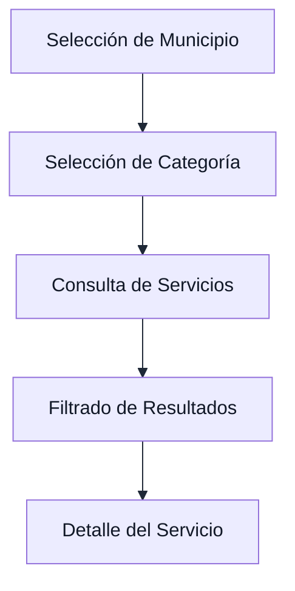
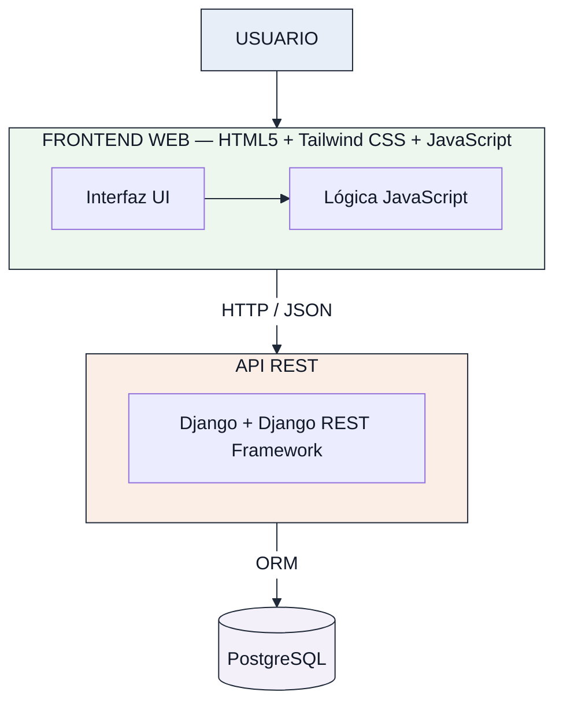
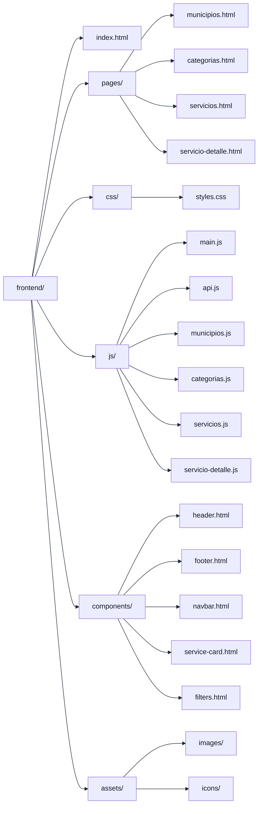
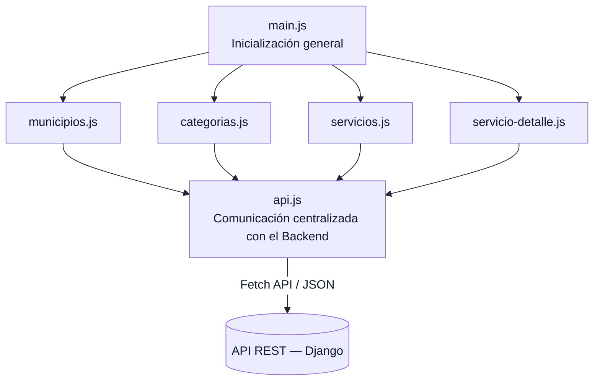
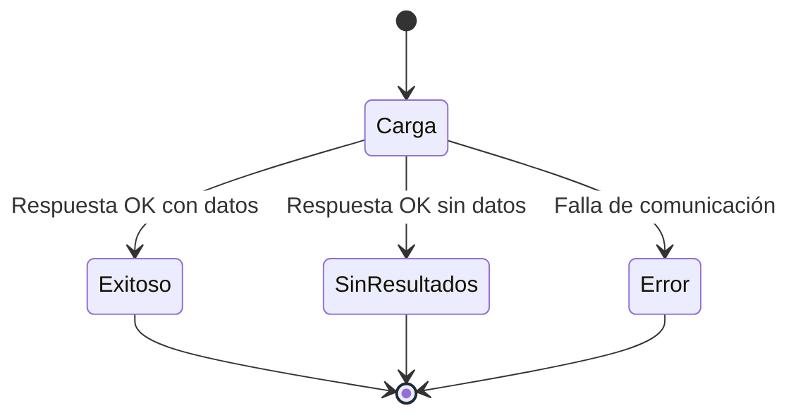
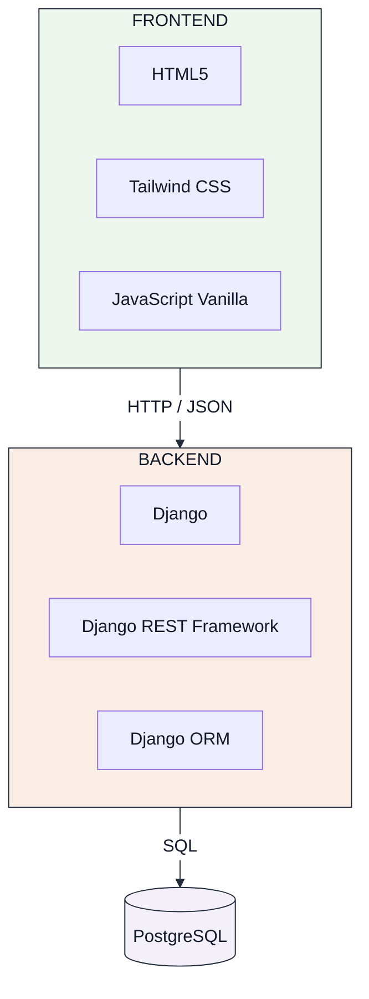
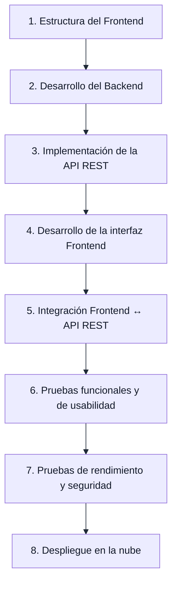

# Estructura del Frontend — RuralConecta-Proyecto

## 1. Identificación del Documento

| Campo | Detalle |
|---|---|
| **Proyecto** | RuralConecta-Proyecto |
| **Componente** | Frontend |
| **Tipo de aplicación** | Aplicación web Full Stack — MVP |
| **Tecnologías principales** | HTML5 + Tailwind CSS + JavaScript Vanilla |
| **Arquitectura** | Frontend desacoplado mediante API REST |
| **Ubicación** | `frontend/` |
| **Documento relacionado** | `docs/arquitectura/especificacion-tecnica.md` |
| **Estado** | Fase de arquitectura y planificación |

---

## 2. Propósito

El Frontend de RuralConecta-Proyecto constituye la capa de presentación de la aplicación web y será responsable de proporcionar al usuario una interfaz sencilla, clara, responsiva y accesible para consultar información sobre servicios y trámites disponibles en comunidades rurales de Antioquia.

El Frontend no tendrá acceso directo a la base de datos. La información dinámica será obtenida mediante solicitudes HTTP hacia la API REST desarrollada en el Backend.

La separación entre ambas capas permitirá mantener una arquitectura desacoplada, facilitando el mantenimiento, las pruebas y futuras ampliaciones del sistema.

### Flujo principal de consulta



---

## 3. Objetivos del Frontend

### 3.1. Objetivo General

Diseñar y estructurar una interfaz web responsiva que permita a los usuarios consultar de manera sencilla y organizada información sobre servicios y trámites de comunidades rurales de Antioquia mediante el consumo de una API REST.

### 3.2. Objetivos Específicos

- Proporcionar una interfaz clara y sencilla para usuarios con diferentes niveles de alfabetización digital.
- Permitir la selección de municipios disponibles en la plataforma.
- Permitir la navegación por categorías de servicios.
- Mostrar y filtrar los servicios disponibles.
- Presentar información detallada de cada servicio.
- Mantener una comunicación desacoplada con el Backend mediante HTTP y JSON.
- Garantizar una correcta visualización en dispositivos móviles, tabletas y computadores.
- Mantener una estructura modular que facilite el mantenimiento y crecimiento futuro del proyecto.
- Optimizar la carga de recursos considerando las posibles limitaciones de conectividad de las zonas rurales.

---

## 4. Tecnologías Seleccionadas

| Tecnología | Uso dentro del Frontend |
|---|---|
| HTML5 | Estructuración semántica de las páginas y contenido. |
| Tailwind CSS | Diseño visual, estilos utilitarios y Responsive Design. |
| JavaScript Vanilla | Lógica de interacción, manipulación del DOM y consumo de la API REST. |
| Fetch API | Comunicación HTTP con el Backend. |
| JSON | Formato de intercambio de información entre Frontend y Backend. |
| Git | Control de versiones. |
| GitHub | Almacenamiento y colaboración sobre el código fuente. |

### Justificación tecnológica

Se utilizará HTML5, Tailwind CSS y JavaScript Vanilla debido a que estas tecnologías permiten construir un MVP ligero sin introducir la complejidad adicional de frameworks frontend como React, Vue o Angular.

La selección busca facilitar el aprendizaje, reducir dependencias innecesarias y mantener una estructura comprensible para el equipo de desarrollo.

Tailwind CSS permitirá implementar una interfaz responsiva mediante clases utilitarias, mientras que JavaScript Vanilla permitirá controlar la interacción de la aplicación y realizar las solicitudes hacia la API REST.

---

## 5. Arquitectura del Frontend

El Frontend forma parte de una arquitectura desacoplada en la que la capa de presentación se comunica con el Backend mediante una API REST.



El Frontend únicamente será responsable de la presentación, interacción y consumo de los datos proporcionados por la API.

---

## 6. Estructura de Directorios

La estructura inicial propuesta para el Frontend es:

```text
frontend/
│
├── index.html
│
├── pages/
│   ├── municipios.html
│   ├── categorias.html
│   ├── servicios.html
│   └── servicio-detalle.html
│
├── css/
│   └── styles.css
│
├── js/
│   ├── main.js
│   ├── api.js
│   ├── municipios.js
│   ├── categorias.js
│   ├── servicios.js
│   └── servicio-detalle.js
│
├── components/
│   ├── header.html
│   ├── footer.html
│   ├── navbar.html
│   ├── service-card.html
│   └── filters.html
│
└── assets/
    ├── images/
    └── icons/
```

Esta organización separa las responsabilidades del Frontend en páginas, estilos, lógica JavaScript, componentes reutilizables y recursos visuales.



---

## 7. Punto de Entrada — `index.html`

El archivo `index.html` será el punto de entrada principal del Frontend.

Su función será presentar inicialmente la plataforma RuralConecta y proporcionar acceso al flujo principal de consulta.

La página podrá contener posteriormente:

- Identidad visual del proyecto.
- Encabezado y navegación.
- Presentación breve de RuralConecta.
- Selector o acceso a municipios.
- Acceso a las categorías de servicios.
- Elementos informativos relevantes.
- Pie de página.

La implementación visual definitiva será realizada durante la etapa correspondiente al desarrollo del Frontend.

---

## 8. Páginas del Sistema

La carpeta `pages/` contendrá las páginas asociadas a los principales procesos de consulta.

### 8.1. `municipios.html`

Será responsable de presentar los municipios disponibles para consulta.

Posteriormente consumirá:

```
GET /api/municipios/
```

Su función será permitir que el usuario seleccione el municipio sobre el cual desea consultar información.

### 8.2. `categorias.html`

Será responsable de presentar las categorías temáticas disponibles.

Las categorías iniciales definidas para el MVP son:

- Salud.
- Educación.
- Transporte.
- Servicios públicos.
- Apoyos sociales.

Posteriormente consumirá:

```
GET /api/categorias/
```

### 8.3. `servicios.html`

Será responsable de presentar el listado de servicios disponibles.

Permitirá posteriormente realizar consultas y filtros utilizando:

```
GET /api/servicios/
```

y parámetros de consulta:

```
/api/servicios/?municipio={id}
/api/servicios/?categoria={id}
/api/servicios/?municipio={id}&categoria={id}
```

### 8.4. `servicio-detalle.html`

Será responsable de mostrar la información completa de un servicio seleccionado.

La información prevista incluye:

- Nombre oficial.
- Descripción.
- Municipio.
- Dirección o ubicación.
- Horarios.
- Requisitos.
- Información de contacto.

Posteriormente consumirá:

```
GET /api/servicios/{id}/
```

---

## 9. Organización de JavaScript

La carpeta `js/` contendrá la lógica funcional del Frontend.



### 9.1. `main.js`

Contendrá la lógica general de inicialización del Frontend.

Sus responsabilidades podrán incluir:

- Inicialización de la aplicación.
- Configuración general.
- Eventos globales.
- Funciones compartidas.

### 9.2. `api.js`

Será el módulo encargado de centralizar la comunicación con el Backend.

Su objetivo será evitar que cada página implemente directamente sus propias solicitudes HTTP.

Las solicitudes estarán orientadas inicialmente a:

```
GET /api/municipios/
GET /api/municipios/{id}/
GET /api/categorias/
GET /api/categorias/{id}/
GET /api/servicios/
GET /api/servicios/{id}/
```

La implementación concreta se realizará cuando la API REST esté disponible.

### 9.3. `municipios.js`

Contendrá la lógica relacionada con:

- Carga de municipios.
- Presentación de municipios.
- Selección del municipio.
- Manejo de estados de carga.
- Manejo de errores.

### 9.4. `categorias.js`

Contendrá la lógica relacionada con:

- Carga de categorías.
- Presentación de categorías.
- Selección de categoría.
- Manejo de estados de carga.
- Manejo de errores.

### 9.5. `servicios.js`

Contendrá la lógica relacionada con:

- Consulta de servicios.
- Filtrado por municipio.
- Filtrado por categoría.
- Presentación de resultados.
- Manejo de resultados vacíos.
- Manejo de errores.

### 9.6. `servicio-detalle.js`

Contendrá la lógica necesaria para:

- Identificar el servicio seleccionado.
- Solicitar sus datos a la API.
- Mostrar la información recibida.
- Manejar errores o servicios inexistentes.

---

## 10. Componentes Reutilizables

La carpeta `components/` permitirá organizar elementos de interfaz que puedan ser utilizados en diferentes páginas.

```text
components/
├── header.html
├── footer.html
├── navbar.html
├── service-card.html
└── filters.html
```

### 10.1. `header.html`

Contendrá el encabezado general de la aplicación.

### 10.2. `footer.html`

Contendrá información común ubicada en la parte inferior de las páginas.

### 10.3. `navbar.html`

Contendrá los elementos principales de navegación.

### 10.4. `service-card.html`

Representará de forma resumida la información de un servicio.

Podrá mostrar inicialmente:

- Nombre.
- Categoría.
- Municipio.
- Descripción resumida.
- Acción para consultar detalles.

### 10.5. `filters.html`

Contendrá los elementos destinados a filtrar el catálogo de servicios.

Los filtros principales serán:

- Municipio
- Categoría

---

## 11. Hojas de Estilo

La carpeta `css/` contendrá los estilos específicos que sean necesarios para complementar Tailwind CSS.

El archivo `styles.css` se utilizará únicamente para reglas que no puedan o no deban resolverse mediante las clases utilitarias de Tailwind.

Se evitará utilizar CSS innecesario o duplicado.

Los estilos deberán mantener:

- Consistencia visual.
- Buena legibilidad.
- Contraste adecuado.
- Diseño responsivo.
- Código organizado.

---

## 12. Recursos Visuales

Los recursos gráficos estarán organizados dentro de:

```text
assets/
├── images/
└── icons/
```

**`images/`** — Contendrá imágenes utilizadas por la aplicación.

**`icons/`** — Contendrá iconos relacionados con:

- Categorías.
- Navegación.
- Acciones.
- Información.
- Servicios.

Los recursos deberán mantenerse optimizados para reducir el peso de transferencia y mejorar el rendimiento en conexiones de baja velocidad.

---

## 13. Flujo de Navegación

El flujo principal del usuario se define de la siguiente manera. El objetivo es reducir la cantidad de pasos necesarios para localizar información.


Este flujo corresponde a los requisitos funcionales definidos para el MVP.

---

## 14. Comunicación con la API REST

La comunicación entre el Frontend y el Backend se realizará mediante el protocolo HTTP/HTTPS.

Los datos serán intercambiados utilizando JSON.

### Recursos principales

| Método | Endpoint | Propósito |
|---|---|---|
| GET | `/api/municipios/` | Obtener municipios. |
| GET | `/api/municipios/{id}/` | Obtener un municipio. |
| GET | `/api/categorias/` | Obtener categorías. |
| GET | `/api/categorias/{id}/` | Obtener una categoría. |
| GET | `/api/servicios/` | Obtener servicios. |
| GET | `/api/servicios/{id}/` | Obtener detalle de un servicio. |

Los filtros se realizarán mediante parámetros de consulta:

```
/api/servicios/?municipio={id}&categoria={id}
```

El Frontend no deberá realizar consultas SQL ni establecer conexiones directas con PostgreSQL.

---

## 15. Manejo de Estados

La interfaz deberá contemplar diferentes estados durante el consumo de información.



### 15.1. Estado de carga

Mientras se obtiene información desde la API deberá mostrarse una indicación visual de carga.

### 15.2. Estado exitoso

Cuando la API responda correctamente, los datos deberán presentarse de manera estructurada.

### 15.3. Estado sin resultados

Cuando una consulta no encuentre servicios, deberá mostrarse un mensaje claro indicando que no existen resultados para los filtros seleccionados.

### 15.4. Estado de error

Si ocurre un problema de comunicación con la API, el usuario deberá recibir un mensaje comprensible sin exponer información técnica sensible.

---

## 16. Responsive Design

El Frontend será desarrollado utilizando un enfoque Responsive Design.

Se contemplarán como referencia:

| Dispositivo | Resolución |
|---|---|
| Móvil | 360 px – 767 px |
| Tablet | 768 px – 1023 px |
| Escritorio | ≥ 1024 px |

La interfaz deberá mantener:

- Legibilidad.
- Navegación sencilla.
- Elementos interactivos accesibles.
- Distribución adecuada del contenido.
- Adaptabilidad a diferentes tamaños de pantalla.

La implementación del diseño utilizará principalmente las utilidades responsive proporcionadas por Tailwind CSS.

---

## 17. Consideraciones de Accesibilidad

La interfaz deberá seguir buenas prácticas básicas de accesibilidad.

Se considerarán:

- Uso de HTML semántico.
- Etiquetas descriptivas para controles.
- Contraste suficiente entre texto y fondo.
- Tamaño adecuado de elementos interactivos.
- Textos comprensibles.
- Uso adecuado de atributos alt en imágenes.
- Navegación coherente.
- Mensajes de error comprensibles.

Los diagramas y representaciones visuales utilizados en la documentación también deberán mantener un contraste suficiente.

**Criterio visual obligatorio:** los textos incluidos en diagramas y gráficas deberán utilizar negro o un tono suficientemente oscuro. No se utilizará texto gris claro sobre fondos claros.

---

## 18. Buenas Prácticas de Desarrollo

La implementación del Frontend seguirá las siguientes prácticas:

### 18.1. Separación de responsabilidades

- **HTML** → estructura y contenido
- **Tailwind / CSS** → presentación visual
- **JavaScript** → comportamiento e interacción
- **API REST** → suministro de información

### 18.2. Reutilización

Se evitará duplicar código y elementos de interfaz cuando puedan ser reutilizados.

### 18.3. Código legible

Se utilizarán nombres descriptivos para:

- Archivos.
- Variables.
- Funciones.
- Clases.
- Elementos.

### 18.4. Modularidad

La lógica JavaScript deberá mantenerse separada según la responsabilidad de cada módulo.

### 18.5. Dependencias mínimas

No se incorporarán frameworks o librerías adicionales sin una justificación técnica.

### 18.6. Control de versiones

Cada cambio significativo deberá registrarse mediante commits descriptivos.

Ejemplos:

```
feat: create frontend structure
feat: add service listing
fix: correct service filtering
docs: update frontend architecture
style: improve responsive layout
```

### 18.7. No duplicación de lógica

Las funciones utilizadas por diferentes páginas deberán centralizarse cuando sea apropiado.

---

## 19. Seguridad en el Frontend

La seguridad del Frontend se implementará como parte del modelo de seguridad general de la aplicación.

Se contemplarán las siguientes medidas:

- No almacenar credenciales sensibles directamente en archivos públicos.
- No incluir secretos o claves privadas dentro del código JavaScript.
- Validar los datos recibidos antes de utilizarlos en la interfaz.
- Evitar la inserción directa de contenido no confiable mediante `innerHTML`.
- Preferir métodos seguros de manipulación del DOM cuando corresponda.
- Mantener la comunicación mediante HTTPS en producción.
- Respetar las políticas CORS configuradas en el Backend.
- No realizar conexiones directas con la base de datos.
- No exponer información sensible en mensajes de error.

La autenticación y autorización no forman parte del flujo público inicial del MVP. En caso de implementarse posteriormente un módulo administrativo, se evaluará el mecanismo de autenticación definido para dicha funcionalidad.

---

## 20. Rendimiento

Debido al contexto de comunidades rurales y posibles limitaciones de conectividad, el Frontend deberá priorizar un bajo consumo de recursos.

Se aplicarán las siguientes prácticas:

- Minimizar archivos innecesarios.
- Optimizar imágenes.
- Evitar dependencias pesadas.
- Mantener respuestas JSON compactas.
- Cargar únicamente los recursos necesarios.
- Evitar solicitudes HTTP innecesarias.
- Utilizar estructuras HTML sencillas.
- Mantener JavaScript modular y eficiente.

La meta de rendimiento definida para las consultas de la API será:

> **Tiempo de respuesta ≤ 2 segundos** en condiciones normales de conectividad.

---

## 21. Integración con el Backend

El Frontend y Backend mantendrán responsabilidades independientes:



Esta separación permitirá desarrollar y probar cada componente de forma independiente.

---

## 22. Alcance de la Estructura del Frontend

En esta etapa se contempla únicamente la organización arquitectónica y estructural del Frontend.

### Incluido

- Estructura de directorios.
- Definición de páginas.
- Definición de módulos JavaScript.
- Definición de componentes reutilizables.
- Organización de estilos.
- Organización de recursos.
- Flujo de navegación.
- Definición de comunicación con API.
- Consideraciones Responsive.
- Buenas prácticas.
- Consideraciones básicas de seguridad y rendimiento.

### No incluido todavía

- Implementación completa de la interfaz.
- Conexión funcional con la API.
- Implementación definitiva de filtros.
- Datos reales.
- Autenticación.
- Panel administrativo.
- Geolocalización.
- Aplicación móvil nativa.
- Funcionalidades de inteligencia artificial.

Estas funcionalidades se desarrollarán o evaluarán en las fases posteriores según el alcance definido para el MVP.

---

## 23. Relación con los Requisitos Funcionales

La estructura del Frontend se encuentra directamente relacionada con los requisitos funcionales definidos en la especificación técnica:

| Requisito | Componente Frontend relacionado |
|---|---|
| RF-01 — Consultar municipios | `municipios.html` + `municipios.js` |
| RF-02 — Consultar categorías | `categorias.html` + `categorias.js` |
| RF-03 — Consultar servicios | `servicios.html` + `servicios.js` |
| RF-04 — Filtrar por municipio | `filters.html` + `servicios.js` |
| RF-05 — Filtrar por categoría | `filters.html` + `servicios.js` |
| RF-06 — Visualizar detalle | `servicio-detalle.html` + `servicio-detalle.js` |
| RF-07 — Consumo JSON | `api.js` |

Esta relación permitirá mantener trazabilidad entre los requisitos funcionales y los componentes encargados de implementarlos.

---

## 24. Estado del Documento

| Elemento | Estado |
|---|---|
| Definición de tecnologías | Completado |
| Definición de arquitectura | Completado |
| Organización de directorios | Definido |
| Definición de páginas | Definido |
| Definición de módulos JavaScript | Definido |
| Definición de componentes | Definido |
| Flujo de navegación | Definido |
| Integración conceptual con API | Definido |
| Diseño visual definitivo | Pendiente |
| Implementación funcional | Pendiente |
| Integración Frontend-Backend | Pendiente |
| Pruebas | Pendiente |
| Despliegue | Pendiente |

---

## 25. Próxima Etapa

Una vez aprobada y registrada la estructura del Frontend, el desarrollo continuará con la implementación progresiva de los componentes definidos.



La estructura podrá ajustarse durante el desarrollo cuando exista una justificación técnica, manteniendo como principios principales la simplicidad, modularidad, mantenibilidad, seguridad y adecuación al alcance del MVP.

---

## 26. Control de Cambios

| Versión | Fecha | Descripción | Responsable |
|---|---|---|---|
| 1.0 | 2026-08-18 | Creación de la estructura técnica inicial del Frontend. | Equipo RuralConecta |