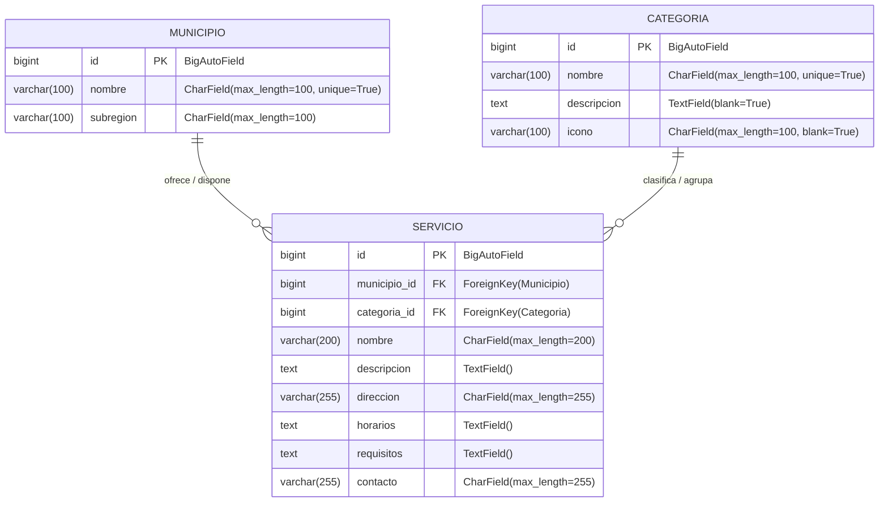

# Modelo de Datos — RuralConecta-Proyecto

## 1. Objetivo

El objetivo de este documento es definir el **diseño conceptual y lógico de la base de datos relacional** para el Producto Mínimo Viable (MVP) de **RuralConecta-ProyectoWeb**. 

El modelo de datos está concebido para soportar de forma óptima, escalable y normalizada la centralización, organización y consulta ágil de servicios esenciales y trámites comunitarios dirigidos a las poblaciones rurales del departamento de Antioquia, garantizando la integridad de la información y sirviendo como base directa para la futura implementación con **PostgreSQL** y **Django ORM** en **Python**.

---

## 2. Entidades

El modelo conceptual del MVP se fundamenta en **tres entidades relacionales principales**:

```text
+---------------+             +---------------+
|   MUNICIPIO   |             |   CATEGORÍA   |
+---------------+             +---------------+
        |                             |
        | 1:N                         | 1:N
        v                             v
+---------------------------------------------+
|                   SERVICIO                  |
+---------------------------------------------+
```

### 2.1. Municipio
Representa las entidades territoriales y divisiones municipales del departamento de Antioquia donde se localizan y prestan los servicios esenciales. Almacena la identificación institucional, el nombre oficial del municipio y la subregión a la cual pertenece.

### 2.2. Categoría
Representa las áreas temáticas mediante las cuales se clasifican y agrupan los servicios y trámites para facilitar una navegación estructurada y comprensible por parte de los ciudadanos. Agrupa áreas prioritarias como *Salud*, *Educación*, *Transporte*, *Servicios públicos* y *Apoyos sociales*.

### 2.3. Servicio
Constituye la entidad nuclear del sistema. Representa cada uno de los trámites, puntos de atención, dependencias comunitarias o programas disponibles para la comunidad rural. Cada registro de servicio almacena información práctica de contacto, ubicación, horarios y requisitos, estando asociado obligatoriamente a un único municipio y a una única categoría temática.

---

## 3. Diccionario de Datos

A continuación se detalla la estructura lógica de cada una de las tablas del modelo, especificando tipos de datos estándar para bases de datos relacionales compatibles con PostgreSQL y Django ORM en Python:

### 3.1. Tabla: `Municipio`

| Campo | Tipo de Dato Propuesto | Clave (PK/FK) | Obligatorio (NOT NULL) | Descripción / Propósito |
|---|---|---|---|---|
| `id` | `INTEGER` / `SERIAL` | **PK** | Sí | Identificador único autoincremental del municipio. |
| `nombre` | `VARCHAR(100)` | Ninguno (Unique) | Sí | Nombre oficial del municipio de Antioquia (ej. "Jericó", "Urrao"). |
| `subregion` | `VARCHAR(100)` | Ninguno | Sí | Subregión de Antioquia a la que pertenece (ej. "Suroeste", "Occidente"). |

### 3.2. Tabla: `Categoria`

| Campo | Tipo de Dato Propuesto | Clave (PK/FK) | Obligatorio (NOT NULL) | Descripción / Propósito |
|---|---|---|---|---|
| `id` | `INTEGER` / `SERIAL` | **PK** | Sí | Identificador único autoincremental de la categoría temática. |
| `nombre` | `VARCHAR(100)` | Ninguno (Unique) | Sí | Nombre de la categoría (ej. "Salud", "Educación", "Transporte"). |
| `descripcion` | `TEXT` | Ninguno | Sí | Descripción conceptual del tipo de trámites y servicios que abarca. |
| `icono` | `VARCHAR(50)` | Ninguno | No | Identificador o clase visual del icono representativo en la interfaz. |

### 3.3. Tabla: `Servicio`

| Campo | Tipo de Dato Propuesto | Clave (PK/FK) | Obligatorio (NOT NULL) | Descripción / Propósito |
|---|---|---|---|---|
| `id` | `INTEGER` / `SERIAL` | **PK** | Sí | Identificador único autoincremental del servicio. |
| `municipio_id` | `INTEGER` | **FK** | Sí | Clave foránea que referencia al municipio prestador (`Municipio.id`). |
| `categoria_id` | `INTEGER` | **FK** | Sí | Clave foránea que referencia a la categoría temática (`Categoria.id`). |
| `nombre` | `VARCHAR(200)` | Ninguno | Sí | Denominación oficial del servicio, trámite o sede de atención. |
| `descripcion` | `TEXT` | Ninguno | Sí | Explicación detallada del servicio y su beneficio comunitario. |
| `direccion` | `VARCHAR(255)` | Ninguno | Sí | Dirección física, sede comunitaria, vereda o punto de referencia. |
| `horarios` | `VARCHAR(255)` | Ninguno | Sí | Días hábiles y franjas horarias de atención presencial o virtual. |
| `requisitos` | `TEXT` | Ninguno | Sí | Documentos, condiciones o requisitos previos exigidos al ciudadano. |
| `contacto` | `VARCHAR(255)` | Ninguno | Sí | Canales directos de atención (teléfono, WhatsApp, correo). |

---

## 4. Relaciones

El modelo conceptual define dos relaciones fundamentales de cardinalidad uno a muchos ($1:N$):

```text
[ MUNICIPIO ] 1 ──── N [ SERVICIO ]
[ CATEGORÍA ] 1 ──── N [ SERVICIO ]
```

### 4.1. Relación Municipio — Servicio ($1:N$)
- **Cardinalidad**: Un `Municipio` puede tener registrados múltiples `Servicios` ($1:N$).
- **Pertenencia**: Cada `Servicio` pertenece de forma obligatoria y exclusiva a un único `Municipio` ($1:1$).
- **Justificación**: Los servicios comunitarios se encuentran territorializados y gestionados bajo la jurisdicción municipal correspondiente.

### 4.2. Relación Categoría — Servicio ($1:N$)
- **Cardinalidad**: Una `Categoría` puede clasificar y contener múltiples `Servicios` ($1:N$).
- **Pertenencia**: Cada `Servicio` se encuentra catalogado bajo una única `Categoría` temática principal ($1:1$).
- **Justificación**: La clasificación unívoca simplifica la búsqueda y reduce la ambigüedad en el flujo de consulta del usuario rural.

---

## 5. Integridad Referencial

Para salvaguardar la coherencia y validez de la información almacenada, el modelo establece las siguientes directrices de integridad:

1. **Claves Primarias (PK)**:
   - Cada tabla implementa una clave primaria subrogada (`id`) entera, autoincremental y no nula, garantizando unicidad absoluta e indexación rápida.
2. **Claves Foráneas (FK)**:
   - `Servicio.municipio_id` referencia obligatoriamente a un registro válido en `Municipio.id`.
   - `Servicio.categoria_id` referencia obligatoriamente a un registro válido en `Categoria.id`.
3. **Restricción de No Nulidad (`NOT NULL`)**:
   - Tanto `municipio_id` como `categoria_id` tienen restricción `NOT NULL`, impidiendo la existencia de servicios huérfanos o descontextualizados.
4. **Política de Eliminación (`ON DELETE RESTRICT` / `PROTECT`)**:
   - No se permitirá eliminar un municipio o una categoría si existen servicios asociados vinculados a ellos, evitando inconsistencias referenciales en cascada no deseadas.
5. **Restricciones de Unicidad (`UNIQUE`)**:
   - Los nombres de los municipios (`Municipio.nombre`) y las categorías (`Categoria.nombre`) son únicos para prevenir duplicidad en los catálogos base.

---

## 6. Diagrama Entidad-Relación

A continuación se presenta el diagrama entidad-relación formal en sintaxis Mermaid compatible con GitHub:



---

## 7. Reglas de Negocio Relacionadas con los Datos

Las siguientes reglas gobiernan la persistencia y validación de los datos en el alcance del MVP:

1. **Obligatoriedad territorial**: Todo servicio debe estar inexcusablemente vinculado a un municipio registrado.
2. **Obligatoriedad temática**: Todo servicio debe estar clasificado bajo una categoría temática válida.
3. **No duplicidad en catálogos**: No se admitirán municipios ni categorías con nombres repetidos en la base de datos.
4. **Completitud de información de servicio**: Los campos `nombre`, `descripcion`, `direccion`, `horarios`, `requisitos` y `contacto` son obligatorios para garantizar que la consulta del ciudadano brinde información de valor práctico y accionable.
5. **Consistencia en consultas**: Las consultas a la entidad `Servicio` podrán filtrarse de manera combinada o independiente por `municipio_id` y `categoria_id`.
6. **Protección estructural**: Los catálogos de municipios y categorías actúan como maestros de referencia protegidos contra borrado involuntario mientras posean servicios asociados.

---

## 8. Consideraciones para PostgreSQL

Cuando el diseño se materialice en el motor de base de datos **PostgreSQL**, se aplicarán las siguientes consideraciones técnicas:

- **Identificadores Autoincrementales**: Implementación de claves primarias mediante tipos `SERIAL`, `BIGSERIAL` o columnas `GENERATED ALWAYS AS IDENTITY`.
- **Tipos de Cadenas**: Utilización de `VARCHAR(n)` para atributos con límites de caracteres previsibles (`nombre`, `subregion`, `direccion`, `contacto`) y tipo `TEXT` para campos descriptivos extensos (`descripcion`, `requisitos`) optimizados por el motor TOAST de PostgreSQL.
- **Juego de Caracteres y Colación**: Codificación `UTF-8` de manera predeterminada para soportar tildes, caracteres especiales y nomenclatura propia del idioma español y toponimia regional.
- **Indexación y Rendimiento**: Creación automática de índices B-Tree para claves primarias y foráneas, permitiendo optimizar las operaciones de combinación (`JOIN`) y filtrado (`WHERE municipio_id = ... AND categoria_id = ...`).

---

## 9. Consideraciones para Django ORM

Durante la **Fase 2 (Desarrollo Backend)**, la implementación de este modelo conceptual en código Python se realizará mediante las clases de **Django ORM** en el archivo `servicios/models.py`. Se aplicarán las siguientes reglas de mapeo:

- **Definición de Modelos**: Heredarán de `models.Model`.
- **Claves Primarias**: Gestionadas automáticamente por Django (`id = models.BigAutoField(primary_key=True)`).
- **Mapeo de Tipos de Campo**:
  - Campos cortos mediante `models.CharField(max_length=...)`.
  - Campos extensos mediante `models.TextField()`.
- **Mapeo de Relaciones e Integridad**:
  - Las claves foráneas en `Servicio` se declararán mediante `models.ForeignKey(Municipio, on_delete=models.PROTECT, related_name='servicios')` y `models.ForeignKey(Categoria, on_delete=models.PROTECT, related_name='servicios')`.
  - La opción `on_delete=models.PROTECT` impedirá la eliminación accidental de entidades maestras que posean servicios vinculados.
- **Unicidad y Metadatos**:
  - Se configurará `unique=True` en el atributo `nombre` de los modelos `Municipio` y `Categoria`.
  - Se implementará el método `__str__()` en cada modelo para representación clara en la consola y en el panel de administración nativo de Django.

---

## 10. Ejemplo Conceptual de Registros

A continuación se presentan tablas ilustrativas con datos ficticios para ejemplificar la interoperabilidad y relación entre las tres entidades:

### 10.1. Registros en `Municipio`
| id | nombre | subregion |
|---|---|---|
| `1` | Jericó | Suroeste |
| `2` | Santa Fe de Antioquia | Occidente |
| `3` | El Carmen de Viboral | Oriente |

### 10.2. Registros en `Categoria`
| id | nombre | descripcion | icono |
|---|---|---|---|
| `1` | Salud | Puestos de salud, jornadas de vacunación, brigadas médicas y dispensarios. | `heart-pulse` |
| `2` | Educación | Sedes educativas rurales, programas de alfabetización y bibliotecas. | `graduation-cap` |
| `3` | Transporte | Rutas de transporte veredal, frecuencias de chivas y cooperativas locales. | `bus` |
| `4` | Servicios públicos | Puntos de atención de acueducto, energía, gas y reporte de fallas. | `droplet` |
| `5` | Apoyos sociales | Subsidios, programas de adulto mayor y asistencia técnica agrícola. | `users` |

### 10.3. Registros en `Servicio`
| id | municipio_id | categoria_id | nombre | descripcion | direccion | horarios | requisitos | contacto |
|---|---|---|---|---|---|---|---|---|
| `1` | `1` *(Jericó)* | `1` *(Salud)* | Puesto de Salud Veredal El Salado | Atención médica general, control de crecimiento y vacunación. | Vereda El Salado, sector La Escuela | Lunes a Jueves: 8:00 AM - 2:00 PM | Documento de identidad y carné de salud. | Tel: 310 000 0001 / salud.jerico@ejemplo.gov.co |
| `2` | `1` *(Jericó)* | `3` *(Transporte)* | Cooperativa de Chivas Veredales Jericó | Servicio de transporte mixto de pasajeros y carga agrícola hacia veredas. | Plaza Principal, bahía oriental | Salidas: 6:00 AM, 12:00 PM y 4:30 PM | Pago del pasaje en efectivo al abordar. | Tel: 320 000 0002 |
| `3` | `2` *(Santa Fe de Antioquia)* | `5` *(Apoyos sociales)* | Oficina de Asistencia y Apoyo al Campesino | Asesoría en subsidios de insumos agrícolas y crédito con entidades aliadas. | Calle 10 # 8-25, Casa Campesina | Lunes a Viernes: 7:30 AM - 1:00 PM | Cédula original y constancia de predio o actividad rural. | Tel: 315 000 0003 / apoyo.rural@santafedeantioquia.gov.co |

---

## 11. Estado del Documento

```text
Fase: 0 — Análisis y planificación
Estado: Propuesta inicial
Implementación: Pendiente
```
