# Evidencias del Proyecto — RuralConecta-ProyectoWeb

Este documento recopila las capturas de pantalla y evidencias del funcionamiento real del Producto Mínimo Viable (MVP) desplegado en producción.

---

## 1. API REST (Backend)

Respuestas en formato JSON de los endpoints principales de la API:

### Municipios (`GET /api/municipios/`)
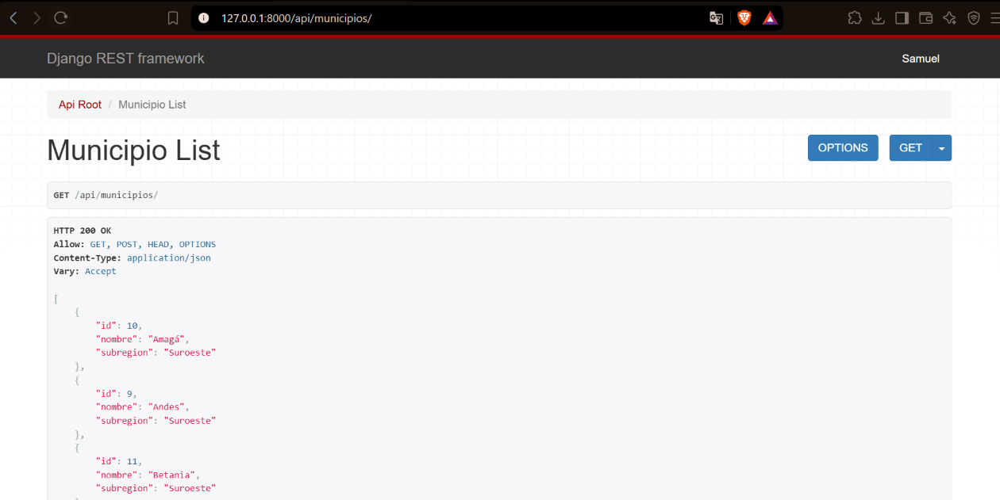

### Categorías (`GET /api/categorias/`)
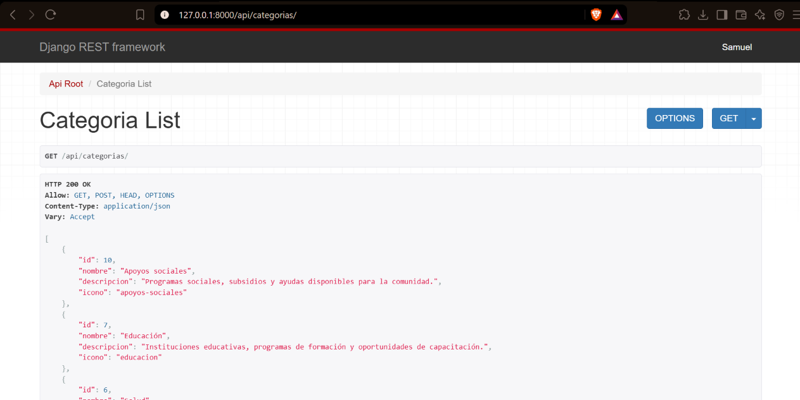

### Servicios (`GET /api/servicios/`)
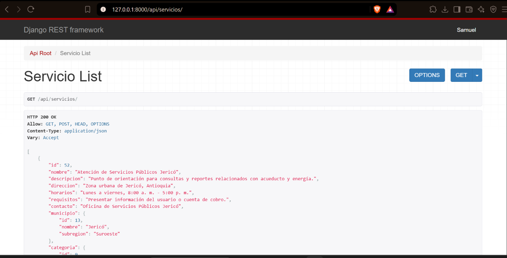

---

## 2. Frontend (Cliente Web)

Visualización de las páginas HTML renderizando los datos consumidos de la API:

### Inicio (`index.html`)
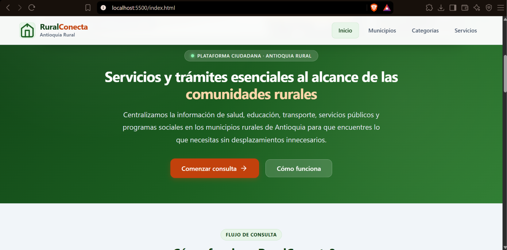

### Catálogo de Municipios (`municipios.html`)
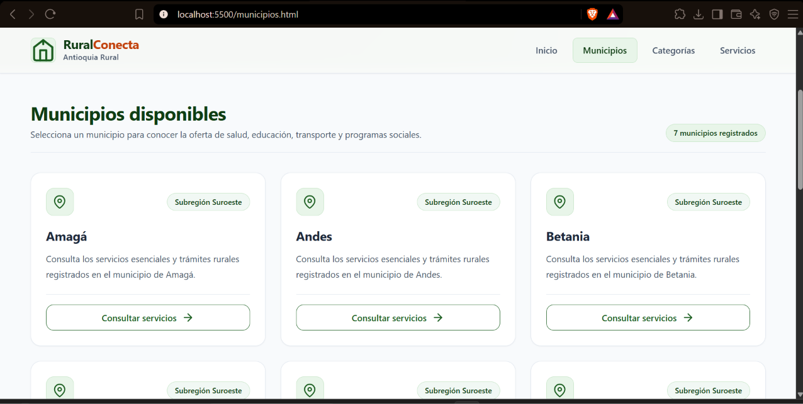

### Catálogo de Categorías (`categorias.html`)
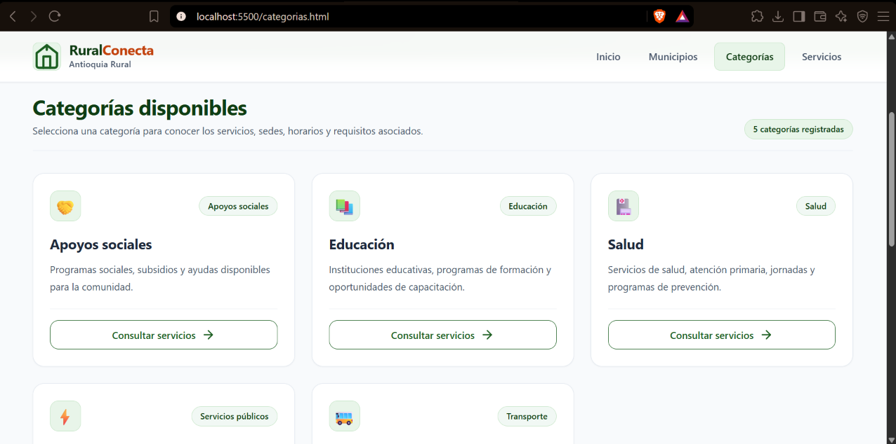

### Listado y Filtrado de Servicios (`servicios.html`)
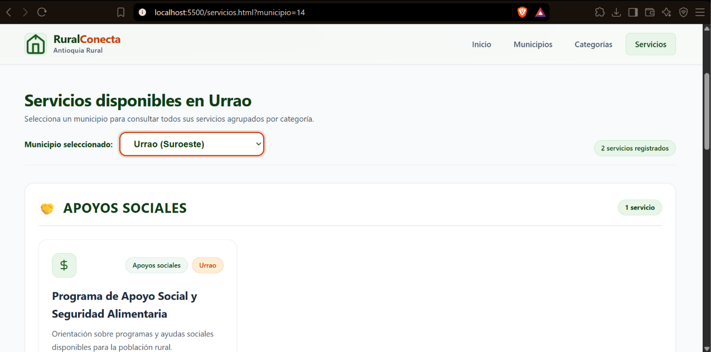

### Detalle del Servicio (`servicio-detalle.html`)
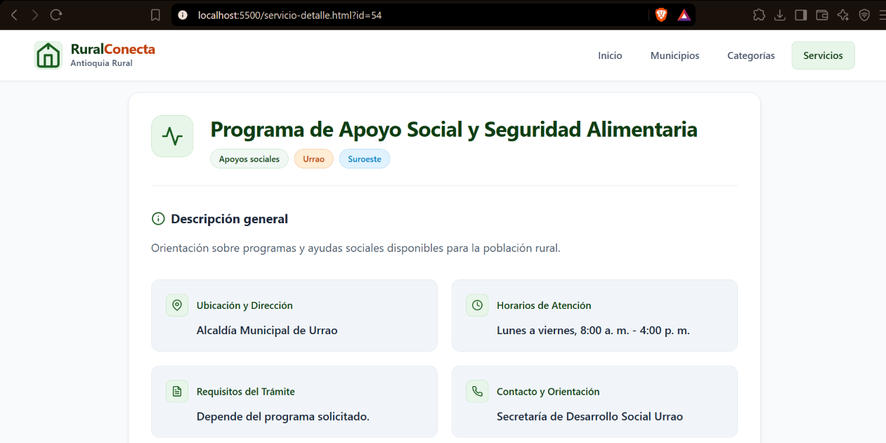

---

## 3. Diseño Responsive

Adaptabilidad de la interfaz en dispositivos móviles:

### Inicio (Móvil)
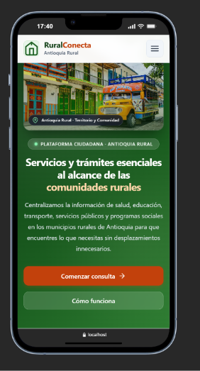

### Municipios (Móvil)
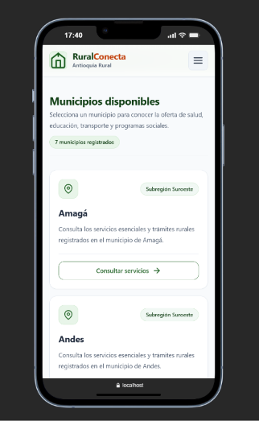

### Categorías (Móvil)
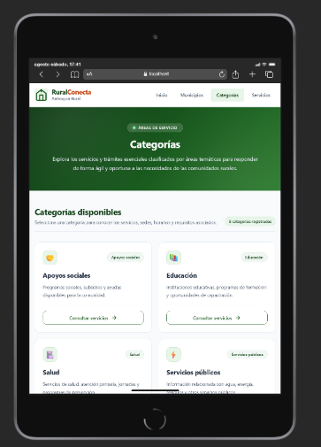

### Servicios (Móvil)
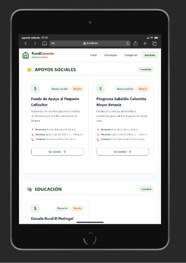

### Detalle (Móvil)
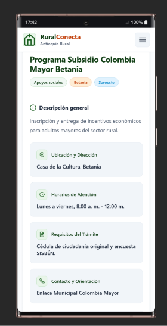

---

## 4. Panel de Administración (Django Admin)

Gestión de datos a través del panel nativo de Django:

### Login
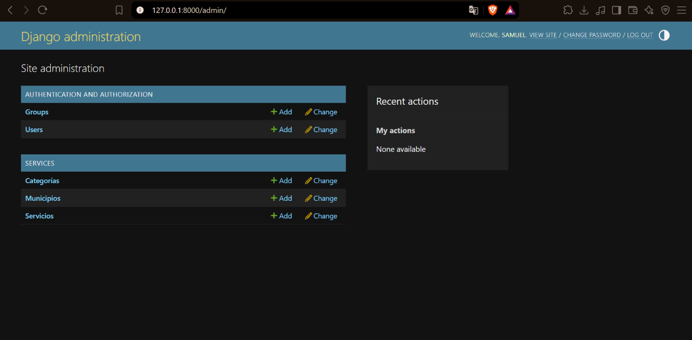

### Gestión de Municipios
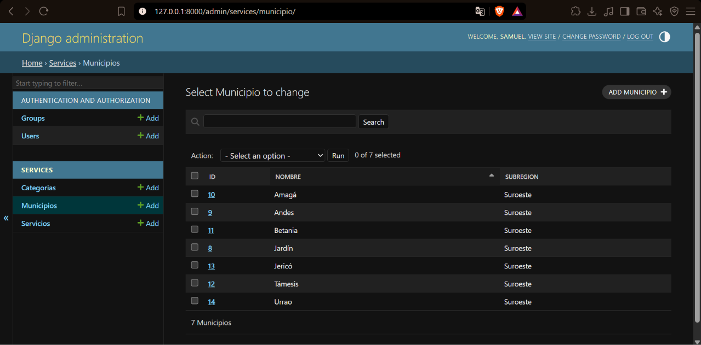

### Gestión de Categorías
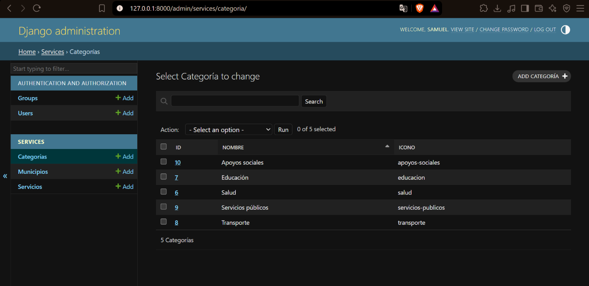

### Gestión de Servicios
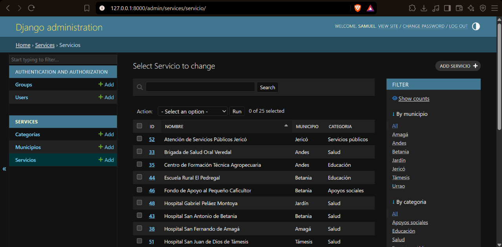

---

## 5. Despliegue en Producción (Render)

### Panel de Control de Render
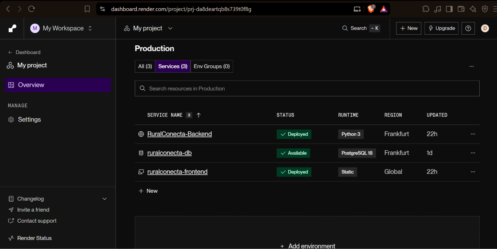

### Backend en Producción
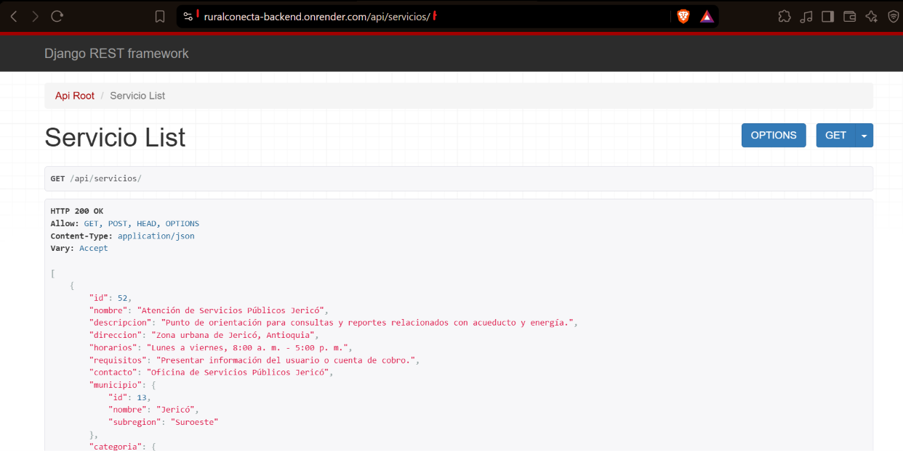

### Frontend en Producción
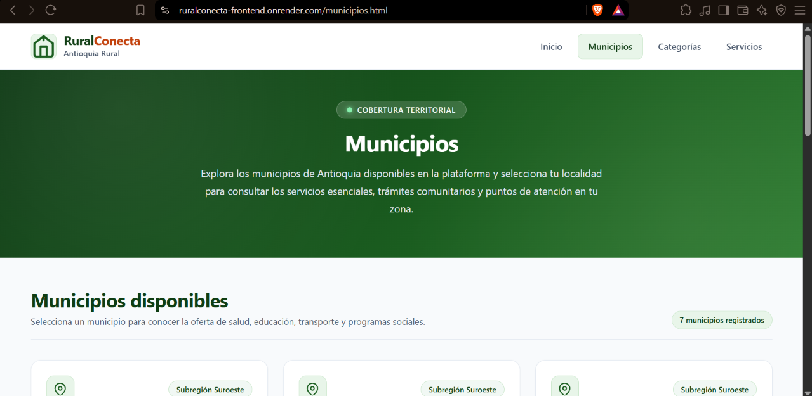
